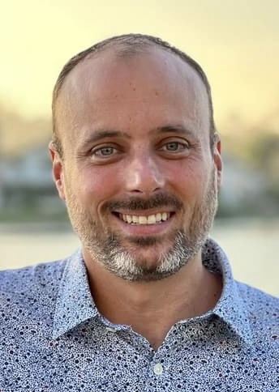

{.alignleft-top} Bryan leads the Developer Engineering team at [VMware](https://cloud.vmware.com/tanzu), helping empower and enable developers to use [Tanzu](https://tanzu.io). Before that, he was a Product Manager at CenturyLink Cloud and spent over ten years prior to that working in a number of various information technology areas including web application development, document management and collaboration, business intelligence, identity and access management, and financial planning and reporting systems. He holds a Bachelor’s Degree in Computer Science from Cal Poly, San Luis Obispo as well as a Master’s Degree in Computer Science and an MBA in Finance from California Lutheran University. He lives in Southern California with his wife, two daughters, and dog Princeton.

You can find Bryan on Twitter at [http://twitter.com/bryanfriedman](http://twitter.com/bryanfriedman) or LinkedIn at [http://www.linkedin.com/in/bryanmfriedman/](http://www.linkedin.com/in/bryanmfriedman/).
