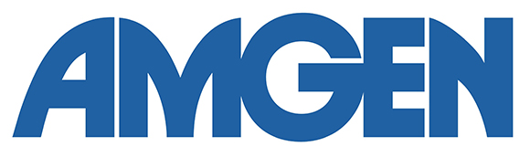
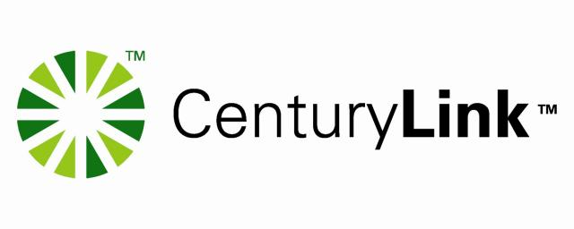

When I was hunting for my first career job as I was winding down my college years, I remember suiting up (though this was a couple of years before _How I Met Your Mother_ aired, so that term may not have been around yet) and going on some interviews offered at the Cal Poly career center. I got through to the second round for two of them. One was for St. Jude Medical in Sylmar (where a few of my Cal Poly Engineering brethren ended up working for a time), and the other was for Amgen in my hometown of Newbury Park.

The entirety of my experience with Amgen at the time had been the lectures that I attended at the conference center there to earn extra credit for my 9th grade biology class. It seemed strange to even consider working there. I figured with my computer science degree, I'd end up in the Bay Area working for some major software development company, or maybe I would join a small startup and get to work with some really innovative, cutting-edge technology or something. I never imagined I'd take a job working in information technology at a large biotech company. Let alone basically going back home to do it.

And yet, as hard as I tried to stay away, there was something appealing about being close to my family, having the kind of benefits that Amgen offered, and still getting to work with technology in some respect. Sure, I wouldn't be flexing my programming muscles as much as I would at a Microsoft or a Google, but it would still be a great opportunity to learn and grow. It's not like I was going to be there forever.

Well, I wasn't...but it sure felt like it. Today will be my last day at Amgen after nearly eleven years, six positions, eight bosses, and only three previously used laptops. On Monday, I start a new job at [CenturyLink Cloud](http://www.centurylinkcloud.com) as Product Manager. Though based in Seattle, I will be working remotely from a home office and traveling up there occasionally to check in and be with the team.

This is a pretty big change for me, both from a career and also a lifestyle perspective. It honestly wasn't even something that I was actively looking for at first. But when presented with the opportunity, it became increasingly clear that it was going to be virtually impossible to pass it up. Though I've been very happy at Amgen, particularly in my latest role there, I have watched the company over the past few years and seen it progressively enter a place where technical skills aren't as valued as they used to be and the thirst for innovation is hard to come by. I've successfully navigated a number of job changes there that all helped me grow and learn so much, and I'm extremely grateful for that. But I like to be able to see the next job that I'm going to take, and I just started having trouble finding it at Amgen.

Thus, when the possibility of joining a high-performance team in a more tech-focused space was pitched to me, hard as my risk-averse self tried to ignore it and stay in the comfort zone that is Amgen, my desire and thirst for something new and different ultimately won out...and I could not be more excited to get started. The real challenge is going to be trying to explain to my daughter that Daddy is still "at work" even though he's physically "at home" also. That, and getting work done while hearing _Frozen_ playing in the other room. But I'm looking forward to it.
