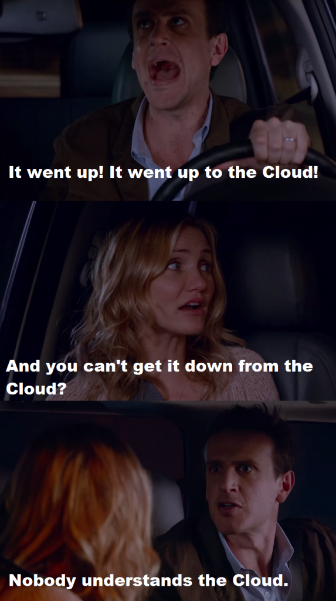
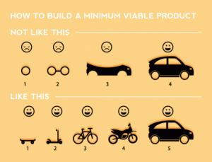
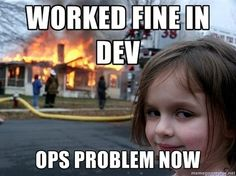

It was exactly one year ago today that I became a [Product Owner](/blog/being-a-product-manager/ "Being a Product Manager") (née Manager) at CenturyLink Cloud, and as a colleague of mine likes to point out, that's a really long time in "cloud years." As I reflect back on the experience I've had so far, it feels good to know that the me of today knows a whole lot more than the me of one year ago. Just as a college student wishes he could go back in time and educate his high school self, I now find myself thinking about the helpful things I could share with my [enterprise IT self](/blog/11-years-later/ "11 Years Later") and all my former colleagues. So with that BuzzFeed-esque premise, here are some things I'd let the trapped-in-IT-purgatory version of myself know about how life _could_ be.

#### You Don't Know The Cloud

Everyone I worked with in IT used to talk about "the cloud" as if they knew what it was and had used it on various projects. Sure, there were plenty of times that a vendor would sell services _branded_ as "Cloud" to attach some buzz to what was really more analogous to a traditional application service provider or legacy hosting model. In reality, almost nobody in IT actually understood or took advantage of cloud for any practical purpose. 

My{.alignright width="263"} favorite definition to use _now_ when describing the cloud is [Dave Nielsen's O.S.S.M. acronym](http://www.daveslist.com/): on-demand, self-service, scalable, measurable. Before, all the cloud really was to me was a series of "as-a-Services" — Infrastructure-as-a-Service (Iaas), Platform-as-a-Service (PaaS), Software-as-a-Service (SaaS) — and we seemed most comfortable with SaaS (a [familiar story](http://www.forbes.com/sites/louiscolumbus/2015/01/24/roundup-of-cloud-computing-forecasts-and-market-estimates-2015/) for many enterprises). I complained plenty about how long it took to get a server stood up and I thought the move the company was making to colocation might begin to solve things. I didn't recognize how much IaaS would have helped with that, or even more how the power of PaaS may have eliminated that need altogether.

The barriers for entry to the cloud were the usual ones — security concerns about data not being on premise, the question of whether our regulated/qualified systems could live on cloud, some perceived lack of control — I've heard them all by now. Except they aren't barriers, they are just [challenges](https://www.centurylinkcloud.com/blog/post/challenges-of-hybrid-cloud-part-i/). Tides are turning and [enterprises are embracing cloud](http://www.rightscale.com/lp/2015-state-of-the-cloud-report-v1), from [public to private to hybrid cloud](http://www.forbes.com/sites/centurylink/2014/11/14/choosing-between-public-and-private-in-the-hybrid-cloud-era/) as well. It's exciting to be working at a cloud company right now.

**Lesson:** Have your IT organization seriously explore a cloud migration. Consider PaaS along with IaaS. Hybrid cloud may also be the way to go. Don't be discouraged by the challenges — there are [ways to work through them](https://www.centurylinkcloud.com/blog/post/recognizing-the-challenges-of-hybrid-cloud-part-ii/).

#### Your Project Management Methodology Is Broken

Most of the projects I worked on in my former life lasted more than a year and yielded little to no value for the business. By the time the original requirements were being delivered, they had already changed and probably weren't even right in the first place. The project methodology we used, RUP (Rational Unified Process), was supposed to handle this problem with iterations. In practice though, this was mostly lip service as the project invariably fell to using a more traditional Waterfall method.

On the team I work on now, we use Agile. There is a wealth of information to be found elsewhere online about [what Agile methodology is](http://en.wikipedia.org/wiki/Agile_software_development) and [how it was born](http://agilemanifesto.org/). There are many forms of Agile such as Scrum or eXtreme Programming to name just two. One of the key elements of Agile is its flexibility in allowing for rapid respond to change. It's about shorter development cycles (called "sprints") and it encourages early delivery and continuous improvement. We do 21-day sprints, though some teams have even shorter iterations (1-2 weeks) depending on what makes sense for a given product. Each sprint is focused on the progressive refinement of new features — delivering some level of value with each release, starting with the {.alignright} [Minimum Viable Product (MVP)](http://leanstack.com/minimum-viable-product/). This creates a constant feedback loop and allows the team to fail fast and course-correct quickly as needed. Every morning there is a "standup" meeting where the whole team stands up and talks about what they are working on. At the end of each cycle we have a retrospective to discuss what went well, what didn't, and what actions we can take to improve the process.

I can already hear some former colleagues pooh-poohing these ideas with utterances of "that doesn't work in a big enterprise environment" or "what about documentation and compliance?" or "it won't fly with the way we do budgeting." Not true. [It _can_ work.](http://www.zdnet.com/article/yes-agile-works-in-larger-enterprise-projects-too/) One of our engineering leaders likes to say something like, "This is the best way we know how to develop software today. If we find a better way tomorrow, we'll do it that way instead." Find a better way and make it work for you.

**Lesson:** Use Agile. Forget about "services" and "projects" and build **products**. Fail fast. Ensure feedback loops. Embrace change!

(It should be noted that some things I've read — mostly by IBM, the purveyor of RUP — are quick to point out that [RUP is a framework while Agile is a software development process](https://www.ibm.com/developerworks/community/blogs/ambler/entry/agile_and_rational_unified_process?lang=en), that [RUP and Agile can co-exist](http://www-01.ibm.com/software/info/television/html/M649306B47502P68.html), or that [RUP could even be considered Agile](http://www.chiron-solutions.com/chiron-professional-journal/2010/12/20/what-is-the-difference-between-rup-and-scrum-methodologies/) (because it uses iterations). All I can add to the conversation is that this has not been my experience and I have seen more success by taking a truly Agile approach. Your mileage may vary.)

#### Learn About DevOps and Spread the Word

For a few months at my old company, I was on a small team tasked with delivering SharePoint. It started out experimentally and wasn't widely used so we were able to fly under the radar a bit and follow our own processes. We did pair programming, frequent releases, progressive refinement, and just the right amount of documentation. Looking back now, we were exhibiting certain Agile characteristics without even knowing it. On top of that, we were responsible for both building _and_ running the whole stack and we embraced automation wherever possible. (I have fond memories of "Redeployer" — our ASCII-art-infused command line tool.) At the time, I'd never heard of DevOps, but I now know that these are some of the key characteristics of DevOps organizations.

One of my first assignments in my new job was to read _The Phoenix Project_ and it was a completely eye-opening experience. It's a great way to be introduced to DevOps if you're unfamiliar with it, as is Richard Seroter's Pluralsight course, [DevOps: The Big Picture](http://www.pluralsight.com/courses/devops-big-picture). Just like with Agile, the resources you can find online about DevOps are endless and will all do a better job defining it than I could. {.alignright} Sticking with the theme of four letter acronym definitions, [John Willis coined C.A.M.S.](https://www.chef.io/blog/2010/07/16/what-devops-means-to-me/) to describe DevOps: culture, automation, measurement, sharing. In a way, it's kind of an [extension of Agile](http://theagileadmin.com/what-is-devops/) for the Operations world...but it's really more than that. To me, it's about the idea that everyone is on the same team, working together towards a common goal. No more "us vs. them" mentality.

Unfortunately, our small, Agile-ish, DevOps-ish SharePoint team did not last long. It got sucked into the enterprise IT vortex never to be productive again. For an organization to truly adopt DevOps it must completely change the way it thinks, starting at the top with upper-level management and cascading all the way down to the boots on the ground. There's no tool for doing DevOps, but there are DevOps-y tools that have gained popularity like [Chef](https://www.chef.io/) (infrastructure as code), [Docker](https://www.docker.com/) (containers), and a [bevy of continuous integration (CI) tools](http://en.wikipedia.org/wiki/Comparison_of_continuous_integration_software).

**Lesson:** You probably can't change your organization to magically embrace DevOps, but you should at least try to adopt whatever DevOps principles you can within your own team...and maybe you should slip a copy of _The Phoenix Project_ under the door of every executive at the company and hope they get the DevOps bug.

#### There Is Database Life Outside Of SQL

One of my favorite computer science courses in college was the relational databases class. Throughout my career in IT, particularly during my days supporting the Finance organization, no skill served me better than my knack for writing complex SQL queries. So the first time I heard about "NoSQL" databases, my brain wasn't ready to comprehend what that meant. Nobody I worked with was ready either. Every application I worked with in enterprise IT had an RDBMS backend. The only "choice" was whether to use SQL Server or Oracle.

I realize this is still largely the case for many organizations. I see plenty of customers now looking for ways to put their critical relational database workloads on the cloud. Still, NoSQL and Big Data are some of the biggest buzz words around, and while enterprises have been relatively slow to adopt them, [this could be the year](http://www.zdnet.com/article/why-2015-will-be-big-for-nosql-databases-couchbase-ceo/) they really start to pick up. Admittedly, my experience with NoSQL databases is still relatively limited, but becoming familiar with some of the different types (like key-value stores or document stores) and many of the primary use cases (distributed, horizontal scalability, extremely large data volume, schemaless data structures) has me thinking about data storage in a way I never used to.

**Lesson:** Relational databases are not the only game in town. Sometimes a relational database is the right answer, but sometimes it isn't. Look for the right situation to consider one of the [many NoSQL alternatives that are available](http://nosql-database.org/). (Shameless Plug: Check out [CenturyLink's recent acquisition](http://news.centurylink.com/news/centurylink-acquires-orchestrate-to-enhance-cloud-platform-with-new-database-capabilities), [Orchestrate.io](https://orchestrate.io/).)

#### _Actually_ Build For Scale

Towards the end of an IT project, just before go-live, we used to retroactively write a Non-Functional Requirements (NFR) document (because it was a mandatory artifact) and usually it would contain made up numbers about performance or load requirements, most of which could never be tested or actually met in the real world. We always tried to scale the app, usually by adding more servers and a load balancer. Of course this was never enough because we were a global company and we put most of our apps in a single location in the United States. (Plus, we usually had a single database server behind the app servers anyway...see above.)

Enterprise applications don't have to be on par with Facebook or Google, but large organizations still need to build apps that scale for both heavy load as well as for a global distribution of users. Just about every application I built during my IT tenure used a basic three-tier architecture and a simple load balancer. In today's modern environment with the convergence of enterprise and consumer apps — users expect things to work just like they do on their web browser at home and on their smartphones and tablets — this just won't cut it anymore. Since leaving the one-track mind of the enterprise, I'm just becoming familiar with some of the emerging architectures (twelve-factor apps,  microservices, containers) that scale better and are more suitable for running in a cloud environment.

**Lesson:** Applications should be designed for scale from the start. Global accessibility and consistent performance across geographies should not be an afterthought. If the tool you select or build does not support your scalability requirements, it will be a failure regardless of how well it works. Consider a more modern architecture and leave the three-tier apps behind.

* * *

As Bob Dylan wrote, "the times they are a-changin'" — and one thing I'm glad about is that in this past year I've finally begun catching up with the times. I know big companies usually have large enterprise IT organizations that always seem to have a stigma for being _behind_ the times. Well, here's another quote for them from German author Eckhart Tolle — "awareness is the greatest agent for change." If you're trapped in an organization like the one I was in, don't wait for your future self to travel back in time and educate you. Educate yourself now and start changing the way you do IT.
