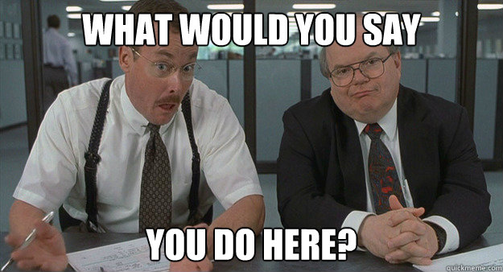
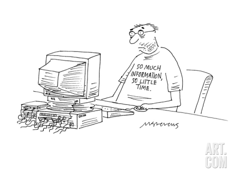
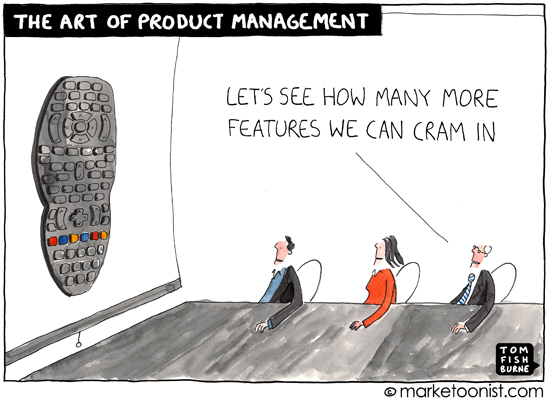

It's been three weeks since I began my Product Manager position at CenturyLink Cloud, and it's been a great experience so far. I've learned so much already and am really enjoying my continuing journey from the enterprise IT world into the cloud computing space.

The most frequent question I've gotten from all of my family and friends since I took this job has been, "So...what do you do?" Of course, when I was working in IT at my previous job, my answer was often just, "I work with computers." I imagine they pictured me helping people fix their computer problems like [Jimmy Fallon's Nick Burns character from SNL](https://www.hulu.com/watch/19050). With this new job, it seems to have become even harder to describe what it is that I do as it seems people often have no idea what the "Cloud" really is or what a product manager does. In fact, even when I accepted the position, I had only a rough idea of how exactly I'd be spending my time on a daily basis. Thankfully, it hasn't taken me too long to figure out. While I was up in Seattle meeting the team last week, we had a very productive discussion about precisely this topic.

As product managers, what exactly do we need to know and what are we actually responsible for doing? First, it's important to understand what we need to know to be an effective product manager, and we learned that there are three key areas of knowledge: **product**, **market**, and **accounts**.

#### What a Product Manager _Knows_

**Product.** Of course, product managers need to know all about their product. I mean, it's in their title — if we don't know the details of the product we are managing, we can't rightfully be called a _product_ manager. This means we have to be intimately familiar with all of the features of the product, including how they work and how to use them, as well as why they were designed a particular way. It also means we need to have some sense of the product roadmap, ultimately being aware of what features are on the near-term horizon as well as at least a broad understanding of where the product is headed over the long term. In the case of our team, this includes _all_ products in our portfolio (though I've heard some teams have product managers assigned to individual features or to one specific product within a portfolio).

**Market.** In order to help us develop our product roadmap and also better understand how our features compare with those of our competitors, we have to stay aware of what's out there in market, what the industry trends are, and where there are gaps, both in our product and in the market in general. For our team, this means keeping up with all the news that's out there about cloud computing — competitor press releases, thought leaders blogs, research articles, white papers, presentations, anything that will let us gain insight into who is doing what with cloud services and where the technology is headed. This means reading...a lot. I've already discovered that consuming so much content and determining what is important to retain can be pretty overwhelming. Luckily, I've found that using services like [Pocket](http://www.getpocket.com), [Flipboard](http://www.flipboard.com), [Feedly](http://www.feedly.com), and [Evernote](http://www.evernote.com) really help me to track lots of information, glean what's important, and save it for reference.

**Accounts.** While it's helpful to see what our competitors and others in the market are doing, there is perhaps nothing more valuable than understanding what our customers are doing with our product(s). Keeping up with the end users is an important part of a product manager's job. Having regular calls or meetings and just maintaining a positive and open relationship with users is a great way to do this. While end users will likely have a relationship and regular interactions with a sales representative or account manager, making sure their channels of communication are open with the product management team as well can make a big difference here. I think this is probably the most challenging of the three knowledge areas to keep up with because it requires such active participation and frequent communication with end users.

Okay, so a product manager has to know a lot...now what do we do with all of this information?

#### What a Product Manager _Does_

In general, a product manager does a lot of information sharing. All of that knowledge we have about the product, market, and accounts, we have to share with various audiences who are interested and need the information to do _their_ jobs. This includes **internal evangelism** where we need to help others in our organization understand what our products are, how they work, how they are evolving, and why we are (or aren't) building a particular feature. It also includes **public engagement** as well — talking about our product, or even our industry in general, on social media, in publications, and at conferences. It's about promoting the product both within the company as well as to the broader community, and since we know the product better than anybody else, what its place is in the market, and how our customers are using it, we are often in the best position to do this.

What I've found most interesting about the product manager role is that it seems to sit right in the middle of so many key functions within an organization. In the case of our team, we are part of Engineering and already work closely with the developers, but we also have to interface very frequently with Operations, Marketing, Sales, and even the end users. Ultimately, all of these various groups are our _customers_. In order to help gain all of that knowledge we need, we need to interact with _all_ of them and keep them engaged and as happy as possible. This can prove to be a difficult task, of course, given all of the competing priorities. 

Given that we sit in Engineering, perhaps our most important job functions include **[backlog](http://agiledictionary.com/7/backlog/) management** and **[sprint](http://agiledictionary.com/195/iteration/) planning**. It is the product management team who is primarily responsible for determining _if_ we are going to build a feature, and *when* we are going to build it. In other words, it doesn't get into the product unless we say it does. Of course, we look to all of our *customers* to help us make the determination, but the decision is essentially ours.This may result in some healthy debate as part of the planning process, and so it helps to be armed with facts (_what we know_) to support these decisions. If a developer is curious about why we have to build a feature, it helps if we can say something like "all of our competitors are doing it" or "our top five clients asked for it." Conversely, if an end user asks why we don't have a feature, it's nice to be able to say "we are working to get it into the product soon" or "we will never be able to support that because it doesn't fit with our vision of the product" or even "have you thought of using this other feature instead to accomplish the same thing?" Sometimes we may even do some **feature prototyping** first to help understand what to build and how it might work.

Along with our engineering team, we need to support our sales and marketing folks as well. We may do some more thorough **competitive analysis**, not only to help us determine what to put into the product, but also to help them better understand our specific value proposition or what the differences are among the feature sets in the market. In the case of our team, we are also tasked with **product definition** as well as potentially helping to determine **product pricing**. This means that we have to work with Finance, Operations, Engineering, and others to find out what it will take to add products to our portfolio so we can figure out the specific details of what the product will look like when it goes to market (i.e. what are specifications, prices, features, value proposition, etc.) Additionally, we may be called upon to help with **sales support** if there is a need for some deeper technical knowledge to help win over a potential customer. It also falls upon the product managers to take responsibility for **analyst briefings** and make sure they have all the information they need to accurately reflect the product offerings in their research papers and market analysis. (CenturyLink Cloud was recently recognized by Gartner in the [Magic Quadrant for Infrastructure as a Service](http://go.centurylinkcloud.com/2014MQ-IaaS?utm_source=media&utm_medium=pressrelease&utm_campaign=MQComm52114&_ga=1.117936585.1372751081.1402101197).)

Finally, let's not forget that there is also the need to continually engage with the end users, not only so we can gain insight into how they are using the product and what features they are interested in, but also to keep them informed on what's coming, as well as helping them get as much as they possibly can out of the product. This can be achieved by writing **release notes**, **knowledge base articles**, and keeping them up to date with **customer briefings**.

One thing I've heard from multiple people is that being a product manager is hard. I'm definitely starting to see why, as there is so much to know and so many decisions to make that have a real impact on all of our _customers_. I'm up for the challenge, though, and excited to continue to learn and develop all the skills and knowledge necessary to be a great product manager and contributing member of our product team.
