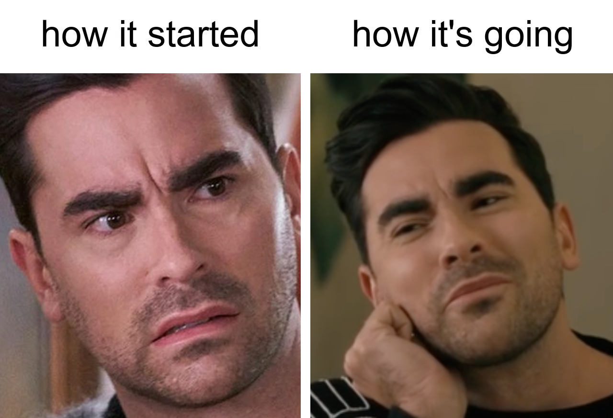

One year ago today, I started at Moderne. It was the week just following the inaugural Code Remix Summit.

One week ago today, I gave a talk at the second [Code Remix Summit](https://www.coderemix.ai). It was my first conference talk since 2019.

So last year I missed Code Remix by one week. But this year I was on the schedule.



When I joined Moderne, it was pretty clear that it was the right move for me, and [I shared my reasons why](https://www.bryanfriedman.com/blog/career-refactoring/). All of that is still true, but what I didn't share at the time is my own list of personal goals I was bringing with me and the areas of growth I wanted to work on. Now, one year in, feels like a good moment to share some of that list and check in on where I've landed.

## Speaking and showing up more

One of the things I hoped to do more of this year was speaking and being more visible in the community. I had definitely let that muscle atrophy a bit in my last few roles, and I missed it. My Code Remix talk was the culmination of a year of slowly turning that dial back up, along with more LinkedIn writing, more demos in front of bigger audiences, and more willingness to put myself out there. I've been really happy with the engagement I've gotten on LinkedIn and fortunate for all the opportunities I've been given to appear and participate in presentations, webinars, and our weekly livestream.

In fact, we've got a little internal leaderboard going for most [Code Remix Weekly](https://www.youtube.com/playlist?list=PLIasdWXKABOmXSFwB5Kt7O8XtRVKE4-RS) appearances. I'm at four, chasing someone who's been at the company at least 4 times as long as me, and he's only ahead by one. Feels pretty good for someone in their first year on the team!

I'd love to do more talks, podcasts, and livestreams, because the only way to get better at it is to keep doing it, and I've got plenty of room for improvement. The funny thing is, every single time, my anxiety builds up so much leading up to it that I wonder why I chose to do it. And then the moment it's over, I'm always glad I did it and already looking for the next one. Apparently this is what wanting it looks like for me.



## Demos and narrative

I came into this job thinking I knew how to build demos in my sleep. A year of doing it at Moderne has reset that for me. The product moves fast enough that staying up-to-date with it is half the work, and you can't tell a story about something you don't understand yet. It's been challenging and fun to follow all the Slack threads, pull requests, and [ADRs](https://adr.github.io/) enough to keep up.

The other half is figuring out the narrative. The demos I'm proudest of this year are the ones where I crafted the most compelling story: the [Java 25 modernization walkthrough](https://www.youtube.com/watch?v=6LGL64AwEEY), the [Prethink launch video](https://www.youtube.com/watch?v=BFXrZ8JfbVU), and the internal, full product demos we created for analysts. I've always considered tech marketing to be [a storytelling role](https://www.bryanfriedman.com/blog/what-is-technical-marketing/), but storytelling for smart, technical audiences is its own discipline. These are people who can spot a hand-wave from a mile away, and who'll ask thoughtful, challenging questions that you can't fake your way to answering. Plus, getting that audience to lean in instead of lean back is the part of the job I've spent the most time trying to get better at, and the part I find the most rewarding.



## Contributing code

Getting closer to code was one of the things I most wanted out of this role, and Moderne has delivered on that in a few different ways. I've gotten to contribute a little code here and there: training modules and recipes, minor commits to the CLI, and especially documentation, where I'm most comfortable anyway. 

But I also spend real time reading through code to understand it, whether it's product code or even the code the product operates on. From picking up more Java to revisiting other languages like Python, JavaScript, and .NET, it's been fun tapping into my engineering core while still staying in my marketing lane.

## Working more closely with product

When I was job hunting last year, I was mostly looking for product roles. Technical marketing wasn't the plan, but it was the path that opened up for me and it turned out to be the right one. Even so, I kept the option of moving back into product open in my head, figuring maybe somewhere down the line I'd eye a product role inside Moderne if the right one came up. But so far, the mix of skills that my technical marketing role has required seems to fit better for me anyway.

So I'm not really chasing a product role right now, but I'm leaning hard into product partnership. We've recently brought on a new outbound product manager, and I'm excited about what that opens up. Another technical storyteller to bounce ideas off of and collaborate with will make my work better. And an outbound PM gives technical marketing something that can sometimes be tough to get enough of: a sharper window into actual customer conversations. That's the part I'm most looking forward to.

## Learning marketing-y stuff

I'll always be technical first. No doubt about that. But one of the things I didn't really expect to come out of this role at first is my growth into the *marketing* part of technical marketing. Product marketing, demand gen, SEO and the digital side, even social media marketing (like I mentioned about LinkedIn earlier) are all areas I've gotten more fluent in over the past year. I've been part of positioning and messaging conversations before, but sometimes I felt like I only half understood, or had to sort of wing it. (I still feel like that at times.) Even my competitive intelligence work, an area I actually had some experience with, has grown through the challenges of a complex and ever-changing market.

Through it all, I have a supportive and experienced team to learn from, and I definitely feel like a more proficient marketer than I was a year ago.

## The AI of it all

When I started, AI was certainly popping up everywhere. It was in job descriptions, market consciousness, and just the general culture. I used AI in my day-to-day, mostly copy-pasting things into and out of ChatGPT to help with writing. Now that workflow looks so primitive. Engineers on our team (and everywhere) started using agents for serious coding work, and I followed suit for docs and demo construction. Now across our marketing team, we're constantly finding new places where agents can help: demand gen, competitive intel, content production, research, anything else we can think of. I don't have it all figured out, and I'm pretty sure nobody does yet. But leaning in, trying new tools, and adapting to new workflows, has been one of the more interesting parts of this last year (but really only 6 months probably).

Not coincidentally, this story is mirrored in our product narrative itself. The conversation around what Moderne does has credibly shifted to include agents alongside humans, because the same thing that makes our platform useful to a developer turns out to be very useful for agents too. Maybe even moreso. The underlying engine hasn't really changed, but the framing has, and so has the work.

## The people

Reflecting on everything I've mentioned so far, I realize that nearly everything I've made progress on this year has a person attached to it. Someone on the team who knew a thing I didn't and was generous enough to bring me along.

I've learned about social engagement and what actually makes content land. I've gotten a real demand gen education and a better appreciation for how leads drive the business. I've had a manager who's pushed me on personal growth and thinking like a marketer in equal measure. I've gotten sharper on narrative and outbound storytelling from working closely with product and product marketing. I've started to [kind of] understand some SEO stuff and the digital side of marketing in ways I certainly never have before. And then there's all the deeply technical stuff I've learned from engineering and leadership. The list goes on.

But it isn't just learning *from* colleagues. So much of the most rewarding work this year has been very collaborative: writing and reviewing drafts back and forth with product marketing, building video content with our multimedia manager, pairing with engineers and sales engineers on demos and training, and tightening narratives with product. The work is better for it, and the process is more fun.

This is one of the gifts of joining a small, sharp team. I came in ready to contribute, which I am, but the real benefit is how much I've picked up from the people around me, and how much I can still learn from them.  I love this team!

## Gratitude, and the next year

A year in, I'm realizing how lucky I am to have landed somewhere that fits so well at this particular moment. The team is amazing, the product is compelling, and the market keeps handing the company new and bigger reasons to exist. Even better, the work itself lets me bring more of myself to the job than most roles would.

I don't know exactly what this next year looks like, but if this last year is any guide, nobody does. Still, I know what I want to keep working on, and I know I'm in the right place to do it.

See you at next year's Code Remix!