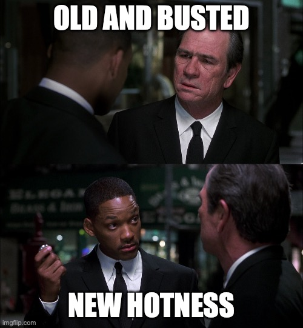
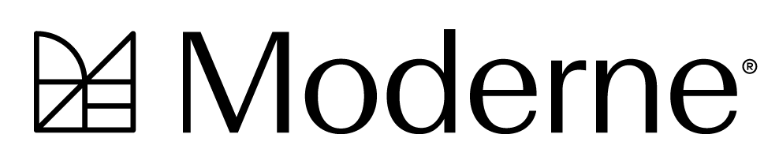

For the past 11 years, ever since I left my first job out of college (which, fun fact, was also an 11 year run), I’ve been [charting my career journey](https://www.bryanfriedman.com/blog/11-years-later/) in this space. It’s been [quite a ride](https://www.bryanfriedman.com/blog/a-hybrid-career/) since then, filled with [diverse roles](https://www.bryanfriedman.com/blog/being-a-product-manager/), inspiring leaders, and [wildly different company cultures](https://www.bryanfriedman.com/blog/5-things-id-tell-my-enterprise-it-self/).

Most of my time has been spent inside large enterprise companies with tens of thousands of employees. In my most recent roles, I’ve been focused on selling software and application platforms _to_ enterprise customers, giving me a unique view from both sides of the table.

That said, I’ve also had a couple of stints in startup or startup-like environments with as few as 100 people. The contrast between those experiences and the enterprise world is stark. It reminds me of some movie quotes...

**“There’s a difference between knowing the path and walking the path.”**
Enterprises tend to be structured. In fact, with rigid processes, strictly defined roles, and lots of layers, I’d say they are often _too_ structured. By contrast, in startups you’ll find more fluid responsibilities, fast pivots, and the need to adapt on the fly.

**“All we have to decide is what to do with the time that is given to us.”**
Startups move fast. Decisions happen quickly. Iterations happen faster. In a big company, getting anything done usually means wading through a frustrating swamp of cross-functional alignment meetings, approvals, and never-ending loops.

**“The study of pressure and time.”**
Sure, enterprises come with an abundance of resources, but agility usually isn’t one of them. Startups might be resource-constrained, but this can force creative thinking and build resilience, which may lead to more innovative outcomes.

**“Old and busted, new hotness.”**
Startups can build with the latest tools, trends, and tech from the ground up. Enterprises, meanwhile, are often tied to legacy systems and are forced to drag a lot of baggage along for the ride. It’s much harder to steer the ship into new waters.

While I have not spent the majority of my career in startups, I’ve _loved_ the time that I have. I still vividly remember my first exposure to startup speed. A bug was discovered, and a fix was coded, tested, and pushed to production all within an hour. My mind was blown. That one moment taught me more than months in the enterprise, and I got to tap into skills I didn’t even know I had.

Eventually, though, I got sucked back into the enterprise machine, and I didn’t fully realize how much it had started to wear on me. The longer I stayed, the more my disillusionment grew as it chipped away at my energy and motivation to break me down.

Now, at last, I am building myself back up. I’m thrilled to say, I’m heading back into startup-land. Today, I’m joining [**Moderne**](https://www.moderne.ai) as a **Technical Marketing Lead**. It checks so many boxes for me.

[{width="640"}](http://www.moderne.ai)

**True Modernization.** Moderne is tackling a challenge close to my heart: _improving code quality and reducing technical debt at scale through automated refactoring_. As a former product manager, I still have scars from punting on feature work so the team could upgrade dependencies, migrate to TypeScript, or swap logging libraries. The opportunity to improve developer productivity and enable [tech stack liquidity](https://www.moderne.ai/content-library/automate-software-modernization-to-accelerate-business) is incredibly exciting.

**Closer to Code.** After years in infrastructure and application platforms, it feels good to get closer to where software actually gets written. I may be in a marketing role, but I’ll still get to frequently nerd out about parsers, visitor patterns, and Lossless Semantic Trees (LSTs) thanks to the magic of [OpenRewrite](https://github.com/openrewrite/rewrite), the open source project powering Moderne’s platform.

**AI That Matters.** The AI boom has been overwhelming, but Moderne isn’t just bolting on AI for buzz. They’re [thoughtfully weaving it into the platform](https://www.moderne.ai/blog/introducing-moderne-multi-repo-ai-agent-for-transforming-code-at-scale), using a hybrid approach to combine their rules-based system of deterministic recipes and balancing it with all that LLMs and machine learning brings to the table.

**Broad Skill Application.** I’ve always gravitated toward roles that blend technical expertise and depth with strength in soft skills like communication, collaboration, storytelling, and problem-solving. Moderne’s small and nimble team gives me the chance to wear multiple hats and contribute wherever I’m needed most.

**People I Respect.** I’m lucky to be joining a team full of [folks I’ve admired for a while](https://www.bryanfriedman.com/blog/springone-platform-2018-lets-get-technical/). It’s energizing to be surrounded by smart, driven people. Plus, there’s a strong Java foundation here that keeps me connected to  [my friends in the](https://www.vmware.com/docs/advocates) [Spring community](https://spring.io/authors).

**Remote First.** The Moderne team is globally distributed, and I’ve been working remotely since before it was cool. While I enjoy an in-person meet-up on occasion, async communication suits me just fine. I've been able to build trust through consistent delivery, and with today’s collaboration tools, it’s easy for remote teams to stay connected and effective.

As I step into this next chapter, I’m excited to help reshape how developers write and maintain software by making refactoring easier, faster, and smarter. Let’s go!