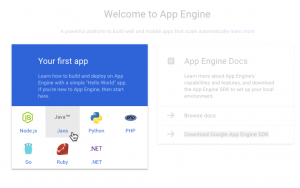

For custom-built applications, using a Platform-as-a-Service (PaaS) solution is an excellent option. With a PaaS, developers simply focus on writing code and pushing an app. It removes the complexity of having to build and maintain any underlying infrastructure.

In this post, I'm going to try out some of the major PaaS offerings and compare and contrast the experiences. There are two different approaches[1](#footnotes) to PaaS adoption:

- **Use a PaaS offered by a public cloud provider.** All the big cloud players have a host of services covering the entire software stack. This includes PaaS, and customers may choose to host applications there.
- **Use a third-party PaaS on top of an IaaS provider.** The alternative is to use a PaaS that can run on many infrastructure providers. The most notable option here is the Cloud Foundry platform.

I'll assess three public cloud provider offerings ([AWS Elastic Beanstalk](#aws-elastic-beanstalk), [Microsoft Azure App Service](#azure-app-service), and [Google App Engine](#google-app-engine)), and one third-party option ([Pivotal Cloud Foundry](#pivotal-cloud-foundry)).

_FULL DISCLOSURE: I work for Pivotal. I've also worked in the IaaS product space for 3 years. I have more than 10 years of experience working in enterprise IT. I'd like to believe I can remain pragmatic and present a fair view of related technologies._

My goal here is not to determine which option is better. To be clear, I'm not going pick a favorite at the end. I won't examine the merits of portability or vendor lock-in. Nor am I interested in getting into a public cloud vs. private cloud debate. I'm also not evaluating price or performance.

For now, I'm looking only at the process of creating and deploying an application. I want to show what kind of options each service offers and get a picture of what the experience is like. (I'll do a followup post to take a look at the Day 2 operations activities like managing and monitoring the apps.)

## Writing the Code

First I needed an application to deploy. For this exercise, I built a very simple one. It's a web service to keep track of movies and television shows that my family and I have watched or want to watch. I call it [Friedflix Media Tracker](https://github.com/bryanfriedman/friedflix-media-tracker).

I could have used a starter app or someone's example code. It would have saved me time and headaches. Instead, because it's been a while since I've written Java, I took the opportunity to learn something new. So I wrote a simple REST endpoint using [Spring Boot](https://projects.spring.io/spring-boot/). To get a more real world experience, I decided to use a persistent datastore as well. (I haven't yet decided if I regret that decision or not.) Since all the public cloud providers offer a MySQL product, that's what I opted to use for my backend.

To keep things simple, I used the Java Persistence API (JPA) and took advantage of the auto schema creation feature. (More info in the [Spring Boot documentation](https://docs.spring.io/spring-boot/docs/current/reference/html/howto-database-initialization.html). My code was also heavily influenced by the Entity-User example on the [Spring "Accessing data with MySQL" Getting Started Guide](https://spring.io/guides/gs/accessing-data-mysql/).) Obviously, [the _create_ setting I used is not something that should be left on for production code](https://github.com/bryanfriedman/friedflix-media-tracker/blob/master/src/main/resources/application.properties#L1). This doesn't take care of actually creating the database, only the tables within the database. We'll still have to create a database for the app to connect to.

## Deploying the Application

For each PaaS, I'll use the UI as well as the CLI where possible. I'll configure the app and database, deploy the code, then finish with a quick manual test to make sure it worked.

### AWS Elastic Beanstalk

With Elastic Beanstalk, I used the _Build a web app_ wizard from the main AWS page to get started. This actually takes care of two steps at once. It creates both an _environment_ containing the necessary AWS resources to host our code, and an _application_ construct that may contain many environments. (If we were to create an app without the wizard, we'd create the application first, then the environment. We can choose to create either a web environment, or a worker node for running related processes.)

Back to the wizard. We enter the application name and set the platform to _Java_ (not _Tomcat_ which will expect a _war_ file, not a _jar_ file). We upload the _jar_ file right here as well (ignoring the fact that it asks for _war_ or _zip_ only). We could set up a few more things we need in the _Configure more options_ sections, but we'll wait and do it later. Click _Create application_ and it spins things up. Once deployed, the app will be available at http://<ENV_NAME>.<ID>.<LOCATION>.elasticbeanstalk.com.

Don't forget, we need our database too. Amazon's RDS offering makes this pretty easy. There's a handy link at the bottom of the _Configuration_ screen in the EB Management Console for our application. We can quickly spin up a MySQL instance with it.

 

The nice thing when we do it this way is that it creates the necessary Security Group and firewall rule for us so that the app may reach the database. Unfortunately, we still have to log in using a MySQL client to actually create the database, as previously discussed. So we add one more rule to the Security Group to let us log in and create the database. (To log in, we can use any MySQL client we like. To connect, we just need to use the database hostname that's listed as the _Endpoint_ from the _Data Tier_ area in the app _Configuration_ screen.)

The last thing we have to do is set our environment variables. With EB and RDS, there are environment variables built-in that we could have used (like _RDS_DB_NAME_, etc.). Instead, we need to set the Spring-specific ones. We do that by clicking the _Software Configuration_ gear and scrolling down to the _Environment Properties_ section. Set the database connection info and also the port, since Elastic Beanstalk will assume port _5000_ while Spring Boot defaults to _8080_.

After applying the environment properties, EB restarts the app for us. So once it's up, we're done!

(We can actually take care of all of the above steps with a few simple CLI commands as well. I included an [example shell script in the GitHub repo](https://github.com/bryanfriedman/friedflix-media-tracker/blob/master/deploy-aws.sh) for reference.)

#### Impressions

- EB makes a lot of assumptions, which tends to make things simpler. One example where I had to override a default, though, was with the port number.
- I'd say the Elastic Beanstalk experience is one of the better ones I've had with AWS products in general. It's pretty seamless and was the lowest friction setup of the three public clouds I tried.
- Actions tended to take a pretty long time. Setting the environment variables restarted the app, for example. Also, there isn't really a queue of activity to follow, so it wasn't always clear what was happening.
- When using the web interface, a manifest file wasn't required. Once entering CLI-land, it's a necessity. Hiding it in the [.elasticbeanstalk directory](https://github.com/bryanfriedman/friedflix-media-tracker/tree/master/.elasticbeanstalk) isn't super user-friendly though. I had to check the docs on that one.
- I'm saving my Day 2 ops post for another day, but just a brief note on logs. (I ended up needing to view them to see what wasn't working at first.) While there doesn't seem to be a native streaming log interface, it wasn't hard to find the logs. Except it was a tad annoying having to download either the last 100 lines or the whole thing every time. There is a decent CLI option here though (_eb logs_).

### Azure App Service

You may be asking, "why on earth would you deploy a Java application to a Windows server anyway?" Fair question. Microsoft has actually done well at embracing Linux recently. At the end of last year, they announced [Azure App Service on Linux](https://channel9.msdn.com/Events/Connect/2016/199), and it went [GA just this month](https://azure.microsoft.com/en-us/blog/general-availability-of-app-service-on-linux-and-web-app-for-containers/). Unfortunately, it doesn't support Java at this time (only PHP, Ruby, Node.js, and .NET Core). While it's great news for some apps, it didn't help me here, so Windows it is.[2](#footnotes)

First, we create the web app. No code needed at this point. Once up and running, the app will be available at http://<APP-NAME>.azurewebsites.net/.

Once it's done creating, we click the newly-created web app in the _App Services_ area. We need to go change the _Application Settings_ to enable Java because it's off by default.

Now we're ready to upload the code. There are a few different ways to do it using the _Deployment Options_ menu. Azure App Services offers integrations with developer IDEs and source code management tools. I just want to upload my _jar_ file[3](#footnotes). The _web deploy_ option that [integrates with IDEs](https://docs.microsoft.com/en-us/java/azure/eclipse/azure-toolkit-for-eclipse-installation) does have a CLI (_msdeploy.exe_) but it's Windows only. No Mac support. So the best option for me in this case is to use FTP. It wouldn't generally be my first choice, but at least it's scriptable. (It also supports FTPS).

To make this work, we have to set up FTP credentials in the _Deployment Credentials_ section.

Then we can get the connection info from the app _Overview_ area.

We'll use the standard FTP _put_ command (or your favorite FTP client) to upload the _jar_ file to the _site/wwwroot_ directory, along with a [manifest file](https://github.com/bryanfriedman/friedflix-media-tracker/blob/master/deploy/manifests/azure/web.config) to specify how to run the app.

Now we have to deal with the MySQL database instance. _MySQL In App_ is offered as part of the Azure App Service, but it's hosted on the same instance as the app and isn't intended for production use. There is an option from [ClearDB](http://w2.cleardb.net/azure/) we could use. As it turns out, though, Azure recently released a preview version of [Azure Database for MySQL](https://azure.microsoft.com/en-us/services/mysql/). We'll try it out.

After creating the instance, we have to take care of some things. First, we need to adjust the firewall rules to allow the app instances to reach the database. We do this in the _Connection Security_ settings, but we have to lookup all the outbound IP addresses for the app first. These are found under the _Properties_ section of the app service.

Notice I also add my IP (with the _\+ Add My IP_ button). This is so I can connect to the instance from my machine and create the actual database, as previously mentioned.

We grab the database server name and login details from the _Overview_ area of the database instance in the Azure portal. Finally, we set the environment variables for connecting to the database.

Now all we have to do is reset the app, and we're all good.

(Once again, we can take care of all of the above steps with the CLI. I included an [example shell script in the GitHub repo](https://github.com/bryanfriedman/friedflix-media-tracker/blob/master/deploy-azure.sh) for reference.)

#### Impressions

- My past experiences with Azure have often felt overwhelming. It seems like there are almost too many options. It's true here too. Even when first creating the app, it wasn't clear which "kind" of app to pick. The Azure Portal UI is notably bad. I'm not a fan of the blades and endless scrolling through settings to get what you need. Use the CLI whenever possible.
- It's not a perfect method, but one way to judge a user experience is by how much documentation you need to refer to. For what it's worth, to deploy my Spring Boot application to Azure, I used at least three separate docs. ([Here](https://docs.microsoft.com/en-us/azure/app-service/app-service-deploy-spring-boot-web-app-on-azure), [here](https://docs.microsoft.com/en-us/azure/mysql/howto-connect-webapp), and [here](https://docs.microsoft.com/en-us/azure/mysql/howto-manage-firewall-using-cli).)
- After the AWS experience and also being familiar with Cloud Foundry, it felt weird not to provide code to get started.
- I ran into a stupid problem of not setting _binary_ mode when uploading my _jar_ file through FTP. Another reason not to use FTP.
- Most manifest files these days use YAML because it's easy to read and pretty easy to write. Having to use XML here wasn't the greatest.
- The interface for adding firewall rules is worse here than I've seen anywhere else. Even if you opt for the CLI, you still have to start by looking up the IPs for each instance.

### Google App Engine

[Google App Engine](https://cloud.google.com/appengine/) (GAE) is the PaaS offering on the Google Cloud Platform (GCP). For each project in GCP, users can create one app. Each app lives at https://<PROJECT-NAME>.appspot.com. It supports one app per project, but has multiple versions that can each host a certain percentage of traffic. It's slightly reminiscent of the application/environment construct on AWS EB, but it's really pretty different from what I've seen on other platforms. It's an interesting way to roll out new code to subsets of users or manage blue-green deployments.

To start, we create the app. Again, no code needed yet.

  

The CLI offers a simple way to do this as well:

`# If not already installed sudo gcloud components install app-engine-java # Now create the app gcloud app create --region us-central`

We've got our app, now let's set up the database. We create a MySQL Second Generation database.

 

The nice thing with Google's interface is that we can actually create the database in the instance right from the portal (or the CLI). No need to log in to the database with a MySQL client.

Once again, this can all be done with the CLI. `# If not already installed sudo gcloud components install beta  # Create database instance gcloud sql instances create friedflix-media-tracker --tier=db-n1-standard-1 --region=us-central1  # Create database gcloud beta sql databases create friedflix --instance=friedflix-media-tracker  # Get connection info gcloud beta sql instances describe friedflix-media-tracker | grep connectionName`

We're almost ready to get our code out there. First, we specify our [_app.yaml_ manifest file](https://github.com/bryanfriedman/friedflix-media-tracker/blob/master/deploy/manifests/gcp/app.yaml) in the [_src/main/appengine_ directory](https://github.com/bryanfriedman/friedflix-media-tracker/tree/master/src/main/appengine). This is the only place where we can enter the environment variables to specify our database details. With GAE, we won't be just uploading the jar file like with all the other services. There doesn't seem to be a way to do this, so we'll take advantage of the [appengine plugin for Maven](https://cloud.google.com/appengine/docs/standard/java/tools/maven). To do that, we have to [add it to our _pom.xml_ file](https://github.com/bryanfriedman/friedflix-media-tracker/blob/master/pom.xml#L103-L107).

`<plugin>   <groupId>com.google.cloud.tools</groupId>   <artifactId>appengine-maven-plugin</artifactId>   <version>1.2.1</version> </plugin>`

To connect to our Cloud SQL database instance, we specified a [special JDBC connection string](https://github.com/bryanfriedman/friedflix-media-tracker/blob/master/src/main/appengine/app.yaml#L11) in our manifest that makes use of the Google Cloud SDK. The benefit here is that we don't need to configure any firewall rules or special settings on the database. The downside is we have a [few additional dependencies we'll need to include in _pom.xml_](https://github.com/bryanfriedman/friedflix-media-tracker/blob/master/pom.xml#L60-L94).

Now we can push our app. We'll use the Maven plugin we enabled.

`./mvnw -DskipTests appengine:deploy`

It takes a while, but the command does complete successfully and we're up and running.

#### Impressions

- If you're not used to the paradigm of one app per project with multiple versions, it's not entirely clear at first. I deployed a lot of versions inadvertently until I figured out the whole traffic splitting thing.
- I had used GAE before, but it was a while ago so things were pretty different. Google's portal UI is usually pretty solid, but it did take me a bit to figure out exactly how things worked here. Again, not providing the code up front felt strange.
- The CLI is easy to use and I preferred it to the portal in most cases. It was very neat to be able to create the database from the UI or CLI without logging into MySQL. It would have been nice to be able to specify environment variables as well, though using the manifest was fine.
- Using the Maven plugin was okay, but I would have liked the flexibility to just provide a _jar_ file and call it a day. The only way I could figure out to do that was to [use the custom runtime and specify the commands to run it in a Dockerfile](https://cloud.google.com/appengine/docs/flexible/java/dev-java-only). I wanted a more pure PaaS experience, so I didn't go that route.
- I ended up needing a fair amount of documentation here too, but it was almost all about connecting to the database. The Cloud SQL dependency stuff was not documented super well. I had to use pieces of documentation from [here](https://cloud.google.com/appengine/docs/flexible/java/using-cloud-sql) and [here](https://cloud.google.com/community/tutorials/run-spring-petclinic-on-app-engine-cloudsql). Even then it required some trial and error to finally get working.
- The deployment took a pretty long time. The CLI gave little indication of what was happening, but I was able to follow along with the streaming logs in the portal.

### Pivotal Cloud Foundry

Pivotal Cloud Foundry (PCF) can run on many cloud IaaS offerings, including AWS, Azure, and GCP, as well as vSphere or OpenStack for on-premise deployments. For this exercise, I will take advantage of the Pivotal Web Services (PWS) offering. PWS is a public, online, managed PCF environment. It comes with an existing marketplace of services like MySQL, RabbitMQ, and Redis. Each app lives at https://<APP-NAME>.cfapps.io/.

While there is a web UI for managing apps and services, a deployment on PCF happens from the _cf_ CLI. Each user of PCF has access to one or more orgs and spaces. These are constructs for multi-tenancy and separation of app environments. We can see (or set) which endpoint, org, and space our CLI will connect to with the _cf target_ command. Mine is set to target my space in PWS.

`api endpoint: https://api.run.pivotal.io api version: 2.94.0 user: [username] org: bfriedman-org space: development`

Everything starts with the _cf push_ command. We can choose to specify required parameters using the command options, or we can use a manifest file. For now, we'll just use the _\-p_ option to target our _jar_ file.

From the top-level of the source code directory:

`cf push friedflix-media-tracker -p target/media-tracker-0.0.1.jar --no-start`

This will push our app, but we've specified that we don't want to start it yet. That's because we still need to create a database and set our environment variables. We can do that from the UI.

To create a database service instance, we leverage the Marketplace:

We'll use the ClearDB MySQL offering and choose the free Spark DB plan for now.

We name the instance and we can even bind it to our app from here.

Now we can go to our app settings, grab the database service connection info, and set our environment variables:

  

_**UPDATE:** Turns out we don't even have to do this step at all! Spring Boot magically detects the database automatically (by looking at existing Cloud Foundry environment variable VCAP_SERVICES) and autowires the configuration for us at startup. Even easier than I thought!_

We start our app and we're good to go.

While the UI is pretty easy, let's take a quick look at the power of the CLI, especially with a manifest. Using the [manifest file](https://github.com/bryanfriedman/friedflix-media-tracker/blob/master/deploy/manifests/pcf/manifest.yml), we can specify the _jar_ file path and bind our database service. We can also set our environment variables without even knowing the values. _(**UPDATE:** We actually don't even have to do that because, same as above, Spring Boot figures it out from the bound service alone. I removed the environment variables from the manifest and it still works!)_ We reference Cloud Foundry's existing properties for the bound services:

`--- applications: - name: friedflix-media-tracker   path: target/media-tracker-0.0.1.jar   buildpack: java_buildpack   services:   - friedflix-db`

Now with the manifest file in the main directory, we simply create the database service and push the app:

`cf create-service cleardb spark friedflix-db cf push`

Before too long, the app is up and running.

#### Impressions

- The web UI is a bit limited, but that also means it's very simple to use. There's real power in the CLI, but the UI is a nice addition for some things.
- The elegance of creating and binding the database service wasn't matched on another platform. In fact, the act of binding creates the database for you, so it really did make it easier than any of the other platforms.
- Setting the environment variables to reference the service properties is awesome. Only the Google SQL connector was close to the ease of deployment, but it required lots of code dependencies.
- Granted, I've had experience using PCF before and all the other platforms were basically new to me. Still, I did have to reference documentation a few times to look up manifest file values and things. Even so, this took me the least amount of time of all the platforms and I ran into the fewest problems starting the app.

## Wrap Up

Each platform had its strengths and weaknesses, as we've seen. All the platforms I looked at here are opinionated to some degree. They all make some assumptions about the application and desired configurations. Yet they all let the developer provide customizations and specific settings.

Pivotal Cloud Foundry seemed to be the most opinionated platform of the bunch. This made it the most frictionless for getting an app deployed. The breadth of services offered by the big cloud providers is very nice though, depending on what you need. This was a pretty simple example, but each platform might make sense for a given workload.

I've also only explored the deployment process here. There is a lot more to discover around Day 2 operations. Once it's out there, we still need to manage and monitor our app. How do we scale it? How do we do health management? Observability? I'll take a look at the options each platform provides in a followup post. Stay tuned!

###### Footnotes

1. I suppose you could consider the third approach of using a PaaS-only provider like Heroku. I didn't consider that here.
2. A better option might have been to use the Azure Container Service. Or maybe I should have chosen to write a Node.js app instead. Either way, that's a separate blog post for another day.
3. I tried to avoid using IDE or source code repository integrations for this exercise. The right thing to do would be to write automated tests and wire up a CI/CD pipeline to push the code to the platform. (Since I'm not a real developer, I did not write tests, although Spring does make that pretty easy.) Yet _another_ separate blog post for another day.
