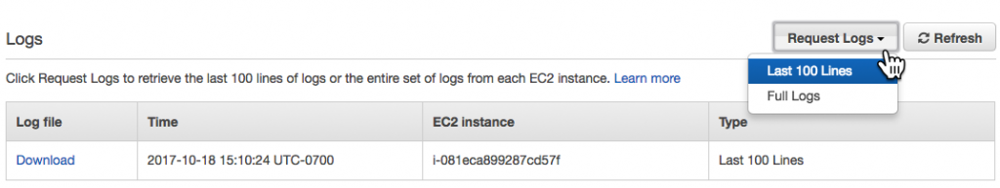
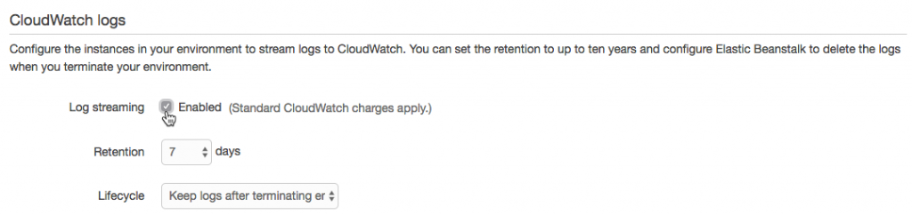
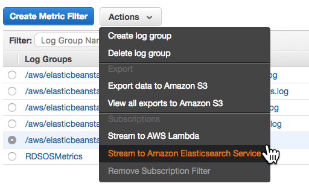
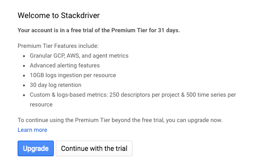
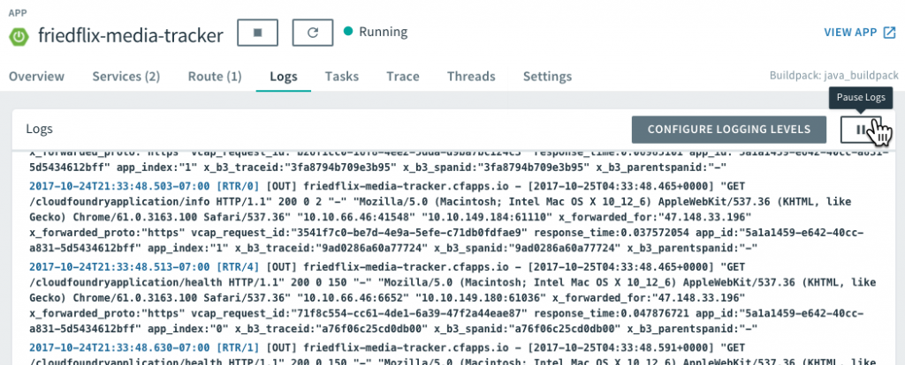
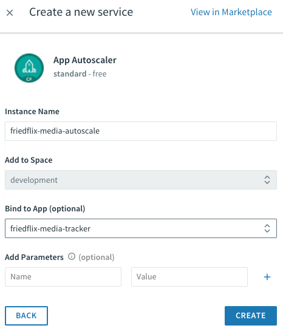
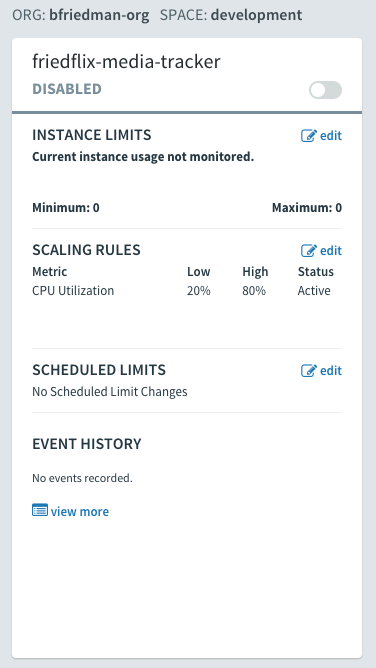

In [my last post, I explored what it's like to deploy a Spring Boot app to four different public PaaS products](http://www.bryanfriedman.com/2017/09/20/comparing-public-cloud-paas-offerings/). Now that the app is live, we have to manage it. As promised, for this post, I'll build on the experience by going beyond the Day 1 deployment. I'll try out some of the features of each platform associated with Day 2 operations.

Once again I'll look at three major public cloud players (AWS Elastic Beanstalk, Microsoft Azure App Service, and Google App Engine), as well as a third-party option that can run on a public or private cloud (Pivotal Cloud Foundry).

_FULL DISCLOSURE: I work for Pivotal. I’ve also worked in the IaaS product space for 3 years. I have more than 10 years of experience working in enterprise IT. I’d like to believe I can remain pragmatic and present a fair view of related technologies._

I'm still not going to pick a winner at the end or make any claims about price or performance along the way. I'm focusing on the ongoing maintenance and management of the app once it's deployed. As before, I'm only interested in exploring the experience that each service provides.

By no means will I (or could I) cover everything required to keep an app up and running. I'll examine three key areas of Day 2 operations — observability, resilience, and patching.

## Observability

The term "observability" comes from control theory and linear dynamic systems. It's "a measure of how well internal states of a system can be inferred by knowledge of its external outputs." In the software world, there are probably some differing opinions about its meaning. It sometimes gets used synonymously with "monitoring" and "logging."

In her post "[Monitoring and Observability](https://medium.com/@copyconstruct/monitoring-and-observability-8417d1952e1c)", Cindy Sridharan does a nice job of breaking it down. She borrows from [Twitter's Observability Engineering Team's charter](https://blog.twitter.com/engineering/en_us/a/2016/observability-at-twitter-technical-overview-part-i.html), and I like the definition. Observability is a _superset_ of things. It has monitoring, but it also includes log aggregation, alerting, tracing, and visualization.

For each PaaS, I'll review some of the features offered that relate to any of these areas.

_Note:_ The public clouds do tend to have a standalone service that covers lots of these features. Amazon has CloudWatch, Azure has Azure Monitor, and Google has Stackdriver. I'll try not to stray too far from the PaaS itself, and won't go into a ton of detail on these offerings. I'll just highlight where it's relevant and integrates with the PaaS product.[1](#footnotes)

### Spring Boot Actuator

Since I'm running a Spring Boot app, I would be remiss not to first mention its Actuator. The Spring Boot Actuator exposes handy built-in HTTP endpoints for monitoring an application. (It supports adding custom endpoints as well.) For example, a _/health_ endpoint shows application health information. This can be useful when setting up alerts to notify operators if a status changes from UP to DOWN for instance.

(By default, most of the endpoints are not routable without authentication. This is easy to enable with Spring Security, but I [disabled it](https://github.com/bryanfriedman/friedflix-media-tracker/blob/master/src/main/resources/application.properties#L3) for the purposes of this exercise.)

It's super simple to include the Spring Boot Actuator as part of a Spring Boot app. It only requires [adding a dependency to the _pom.xml_ file](https://github.com/bryanfriedman/friedflix-media-tracker/blob/master/pom.xml#L28-L31).

I'll take advantage of the _/health_ endpoint when using various platform monitoring features.

### AWS Elastic Beanstalk

From a UI perspective, AWS does a nice job of making the observability features easy to find. There are menu items on the left navigation for Logs, Health, Monitoring, and Alarms. The Health section shows an overview of the application status. It includes other metrics like response codes, latency, and CPU utilization. (A similar view is also available from the CLI by using _eb health_.)

By default, it uses a TCP connection on port 80 to determine application health. We can set it to use a specific HTTP request instead from the Health section of the Configuration area. We'll start by setting the "Application health check URL" to the _/health_ endpoint.

 

This sets the health check URL for the load balancer that sits in front of the application. We could also modify the Elastic Load Balancer (ELB) health check settings directly if we chose to. It supports different timeout and interval durations as well as customizable thresholds. This is set through the Load Balancer area of the EC2 service.

Back in the EB console, the Monitoring dashboard offers some nice visualizations on metrics like requests, health, and latency. It's also customizable, depending on what CloudWatch metrics are available.

This is the place where Alarms can be set up as well to send notifications based on certain thresholds. Here, I've set up an Alarm to notify me when CPU usage goes above 90% for 5 minutes.

And finally, Logs. You can easily download the last 100 lines or the full set of logs through the UI. As I mentioned last time, there is no simple interface for streaming or viewing them. Not a big deal, but you're stuck downloading and viewing in your browser or favorite text editor.

The last 100 lines option concatenates the most common logs together, but only the last 100 lines of each. The full log download isn't aggregated at all. Web server, application server, errors, platform operations— they each have their own output.

Downloading logs as above (or using _eb logs_) is what I used to do basic troubleshooting to get the app up and running. These logs only stick around for 15 minutes, so there are some options for log persistence. For one, they can be rotated and published to Amazon S3. AWS also offers integration with their CloudWatch monitoring service. This is the way to get streaming logs if you want them.

 

After enabling log streaming in the Software Configuration section, logs appear in CloudWatch. From there, they can be viewed in real time or sent off to Elasticsearch or S3 as needed.

 

### Azure App Service

As with everything in Azure, the user interface can feel overwhelming at times. To discover what monitoring options Azure offers, I found [this overview document](https://docs.microsoft.com/en-us/azure/monitoring-and-diagnostics/monitoring-overview) helpful. It's more about monitoring Azure services holistically, but can be applied here too. It describes three tools and gives examples of when to use which one, which is useful. The tools are Azure Monitor, Application Insights, and Log Analytics.

The Azure Monitor interface is the consolidated UI view for all these services. From there you can create and configure metrics and alerts. Remember, this is a global view across all Azure resources, so you always have to target the specific App Service. Alternatively, you could access these settings on the App Service blade. Metrics are available on the "Overview" dashboard linked to from the top of the App Service left menu.

By default, visualizations appear for key metrics like requests, response time, and errors. The dashboard is pretty customizable though, and you can pin charts as desired. Clicking on a chart lets you configure metrics and other simple options like type or time range.

From here you can set alerts as well.[2](#footnotes) The "+ Add metric alert_"_ button will let you create an alert on various metrics like CPU time or response codes. It also supports alerts for events like successful stop or failed start. There doesn't seem to be a way to configure a health check endpoint though.

The Azure Monitor interface also provides access to Application Insights and Log Analytics. Application Insights is Azure's APM tool. (I'm not going to go into detail on APM in this post.[1](#footnotes)) Log Analytics supports capturing various details like infrastructure logs and Windows metrics. Unfortunately, it doesn't appear to support capturing application logs. (I did find [this blog post on how to programatically push application logs to Log Analytics](https://blog.adamfurmanek.pl/2017/06/10/capturing-azure-webapp-application-log-in-azure-log-analytics/) but I didn't try it.)

So Azure Monitor isn't super helpful for App Service users after all. We're back to the App Service blade menu to view application logs. You must first turn them on in the "Diagnostics Logs" section, and then you can view them in the "Log stream." You can also choose to store them in Azure storage.

 

The one other place I found worth exploring was the "Advanced Tools" option. It uses the [Kudu project](https://github.com/projectkudu/kudu) to provide various tools including a log stream, among other things.

While I didn't get into the CLI much, there are options there as well. Tail and download logs with with _az webapp log_ or configure alerts and metrics with _az monitor_.

### Google App Engine

Most of Google's Day 2 operational functions are part of GCP's Stackdriver product. With Stackdriver, you can set up Alerting and Uptime Checks and view dashboards. (It also supports Debugging and Tracing if you've enabled your project for them.[1](#footnotes)) From within the native GAE interface, we do have access to a few things. We have a basic dashboard for viewing certain metrics over time. We can also view streaming logs for each instance or version running. This links to the Stackdriver Logging area where we can stream and search through logs.

 

I used this interface plenty while deploying the app to discover problems. It's the best logging interface I saw from any of the public cloud PaaS products. It even supports exporting logs to GCP storage services and creating metrics based on the content of log entries. Of course the CLI offers _gcloud app logs_ as well.

For anything beyond the logs, we have to move on to a full-fledged Stackdriver account. You have to select the project to monitor, since it applies to all GCP services, not just App Engine. There are two account types — free or premium. Premium provides longer retention times and more customizations, but costs extra. I signed up for a 30-day trial of premium features.

After activating a Stackdriver account, it provides instructions on installing a monitoring agent. This enables collecting even more information from the VM than is available from GAE alone. It would be nice if this were more automated or even already included. It wouldn't be too hard to script I suppose, but I didn't go through with it for this exercise.

Strackdriver lets you create alerting policies, uptime monitors and custom dashboards.

Alerting policies are super granular. They let you create notifications based on many different conditions. (Some are only for premium users.) It supports not only metrics, but health alerts as well.

 

Again, I created a basic condition to alert after 5 minutes of CPU usage above 90%.

After setting the condition, you set the notification mechanism. There are plenty of choices, particularly for premium users, but I opted for simple e-mail for now. Then you name the policy and optionally set a message to go along with the notification which is a nice feature.

 

Uptime monitors (health checks) are also configured in Stackdriver. You set the type, path and polling interval. It even supports advanced settings like custom headers, authentication, and response text matching. I set up a simple check against the Actuator's _/health_ endpoint. From there you can set up an alert policy as above to notify when there's a problem.

 

_Note:_ These settings are separate from the [health checks you can set in the _app.yaml_ file](https://cloud.google.com/appengine/docs/flexible/python/configuring-your-app-with-app-yaml#health_checks). Those seem to handle where to send load balancer traffic to as opposed to any kind of alerting.

### Pivotal Cloud Foundry

By default, PCF performs health checks using a TCP port to determine whether to route traffic to a given instance. If a connection can be established within 1 second, it is considered healthy. For HTTP apps, PCF also supports setting a health check endpoint using either the CLI or the manifest. In this case, it expects to receive a 200 OK response within 1 second. ([The PCF documentation provides great detail around how health checks work](https://docs.run.pivotal.io/devguide/deploy-apps/healthchecks.html#health_checks_work).)

From the command line you can set the health check at time of deployment with the _\-u_ parameter. You can also set it after the fact with the _cf set-health-check_ command and an app restart. I've [updated the manifest file in my GitHub repo to include the health check settings](https://github.com/bryanfriedman/friedflix-media-tracker/blob/master/manifest.yml#L6-L7). Here, I also show how to use the CLI to set the endpoint:

`cf set-health-check friedflix-media-tracker http --endpoint /health`

As for logging and metrics, these are some of PCF's strongest areas. The Loggregator system collects all logs and metrics from apps and platform components and streams them to a single endpoint. The logs can be viewed from the Logs page in Apps Manager. They can also be retrieved using the _cf logs_ command from the CLI.

There is also the option to launch [PCF Metrics](http://docs.pivotal.io/pcf-metrics/1-4/index.html) (from the Overview tab) for a closer look at the data. PCF Metrics stores logs, metrics data, and event data from the past two weeks.

PCF Metrics displays graphical representations of the logs, metrics, and event data. It includes data views for container and network metrics (CPU, latency, etc.), app events, and logs. This is very handy for helping operators and developers troubleshoot problems. For example, when the events view shows a crash, it can be correlated with corresponding container and network metrics and the log output for that same time period.

If these built-in logs and metrics tools aren't enough, there is yet another option. The endpoint where logs and metrics get sent is called the Firehose. PCF supports configuring plugins, called nozzles, for the Firehose. They can send custom data to the log stream, or have an external service consume data from the stream. Write a [custom nozzle](https://docs.pivotal.io/tiledev/nozzle.html), or use one of the Marketplace offerings. Tools like New Relic or Datadog [can be set up this way](https://docs.pivotal.io/pivotalcf/1-12/monitoring/metrics.html) to perform more advanced monitoring and alerting.

Finally, since we used the Spring Boot Actuator, we have a few extra features to explore. PCF actually offers quite a few [nice integrations with the Spring Boot Actuator](https://docs.run.pivotal.io/console/using-actuators.html). Thanks to the _/health_ endpoint, we can view the app health right from within Apps Manager on the Overview tab:

The _/dump_ and _/trace_ endpoints allow us to view the thread dump and request traces right from the UI as well.

We can even configure logging levels and filter which loggers to show. This is all done right from Apps Manager without even redeploying the app.

### Impressions

- AWS Elastic Beanstalk has some handy options, and the interface is pretty easy to use. Most of the more advanced metrics and logging features require getting deeper into CloudWatch though.
- Azure, as before, required me to hunt through a lot of documentation to figure things out. The user interface is at best inconsistent. The UI is definitely a pretty big weak spot for Azure in general. It's not enough to completely deter usage, but it's something to consider for heavy web portal users. Also, many of the Azure Monitor services seemed to offer nice integrations with other Azure services but not so much with App Service.
- Aside from the free vs. premium features in Google, the GAE tools were very nice from an interface perspective. In particular, the alerting interface was very rich but still easy to use.
- PCF's logging interface was a clear winner. Only Google's Stackdriver log interface even came close to what PCF's Loggregator provides. PCF Metrics is also quite nice for correlating metrics with logs. For Spring Boot apps, PCF has a clear advantage given the extra integrations and ease of use.

## Resilience

What do I mean by resilience? I'm not doing a deep dive into HA best practices here. For the moment, I'm referring to features around scaling, autoscaling, and self-healing. Since our app itself is stateless, we can rely on multiple instances of the app to easily scale it out (or in). As for self-healing, I [added a _/crash_ endpoint](https://github.com/bryanfriedman/friedflix-media-tracker/blob/master/src/main/java/friedflix/mediatracker/FriedflixCrashController.java) to help test how each PaaS handles losing an instance.

### AWS Elastic Beanstalk

As stated before, AWS EB uses an ELB in front of the app, so it offers some good scaling options. (This assumes the environment type is "load balanced, auto scaling" as opposed to "single instance.")

The _eb scale_ command lets us quickly set a specific number of instances to be running using the CLI. In the UI, the Scaling box of the Configuration section has what we need.

For manual scaling, we can set instance counts and desired availability zones. We can also configure autoscaling pretty granularly with a nice selection of triggers. If we prefer time-based scaling for peak hours or days, it's available as well.

 

On the self-healing front, Elastic Beanstalk handles things gracefully without any additional configuration. I crashed the app when it was set to run one instance only. In this case, I experienced only a very brief period of downtime before it restarted. (I actually did it twice to make sure it worked as the first time I missed the window.) When crashing it with two instances running, there was no downtime. It started the second instance in the background.

### Azure App Service

In Azure, the options for manual scaling actually include both horizontal and vertical. You can opt to scale up (or down) by selecting a different App Service Plan size. This replaces underlying VMs in favor of ones with specified CPU-Memory settings.

For scaling out, there is a way to specify the number of instances as well as configuring autoscaling. The autoscaling rules are granular and can be set trigger on a number of metrics.

 

Scaling options can be set from the CLI as well using the _az appservice plan update_ command. It's clear that there is a load balancer component involved to enable the scale out features. Except, there isn't a way to access its settings or view the individual instance health like we saw with AWS.

When I tested the self-healing feature using the _/crash_ endpoint, Azure handled things. I never saw a _4xx_ or _5xx_ error, but the app did take a little longer to load after a crash, even with multiple instances. The app eventually would come back, but it always seemed to take at least a minute to recover. (Maybe load balancer related? I'm not sure.)

This is a feature called [Proactive Auto Heal](https://blogs.msdn.microsoft.com/appserviceteam/2017/08/17/proactive-auto-heal/) and it was introduced [not that long ago](https://blogs.msdn.microsoft.com/appserviceteam/2017/08/17/proactive-auto-heal/). It's turned on by default and will restart the app based on percent of memory used or percent of failed requests. Auto heal actions [can also be set in the manifest file](https://azure.microsoft.com/en-us/blog/auto-healing-windows-azure-web-sites/). This was the way to configure it before the proactive feature was implemented.

### Google App Engine

When I deployed my app to GAE, [I used a Flexible environment](https://github.com/bryanfriedman/friedflix-media-tracker/blob/master/deploy/manifests/gcp/app.yaml#L2). Google does offer a Standard product option as an alternative. They provide [documentation contrasting them](https://cloud.google.com/appengine/docs/the-appengine-environments) with guidance on when to choose each. I mention this because there are some differences in how each type handles scaling. The documentation [outlines this](https://cloud.google.com/appengine/docs/flexible/java/flexible-for-standard-users#scaling_characteristics), so I'm not going to go into much detail on that here. I'll look at how scaling works for my app in the Flexible environment.

By default, GAE has autoscaling turned on. It starts with two instances minimum and will scale up with 50% CPU utilization. These settings can be [changed in the _app.yaml_ file](https://cloud.google.com/appengine/docs/flexible/java/configuring-your-app-with-app-yaml#services). (You also set the instance size and resource settings here.) With the Flexible environment at least, there doesn't seem to be a way to trigger autoscale with anything other than CPU usage. Manual scaling happens the same way — [in _app.yaml_](https://cloud.google.com/appengine/docs/flexible/java/configuring-your-app-with-app-yaml#manual-scaling). There's no clear way to change any scaling settings in the UI or CLI other than modifying _app.yaml_ [or using the API](https://cloud.google.com/appengine/docs/standard/python/refdocs/google.appengine.api.modules.modules).

`automatic_scaling:   min_num_instances: 5   max_num_instances: 20   cool_down_period_sec: 120 # default value   cpu_utilization:     target_utilization: 0.5`

Finally, I tested the self-healing capabilities using the _/crash_ endpoint. With no extra configuration and two instances, I experienced no downtime. When I crashed both instances in succession, it took less than a minute for at least one to come back.

### Pivotal Cloud Foundry

PCF lets you easily scale number of instances as well as memory and disk limits via the UI or CLI. Using the CLI, the _cf scale_ command lets you specify the scaling parameters:

`cf scale -i 4`

The same can be done through Apps Manager right on the Overview tab:

Pivotal Cloud Foundry offers autoscaling through the App Autoscaler available in the Marketplace. Add it with the standard _cf create-service_ command or from the Marketplace UI.

`cf create-service app-autoscaler standard friedflix-media-autoscale`

From the Service page in Apps Manager, use the "Manage" link to control autoscaling. Minimum and maximum instances get specified. Rules can be set based on CPU utilization or HTTP throughput and latency. Thresholds are set as percentages for scaling down or up. Finally, similar to AWS, you also can set scheduled changes based on date and time.

Like all the platforms, PCF does self-healing and handles crashed instances gracefully. With multiple instances running, there's no downtime after hitting the _/crash_ endpoint. Instances only took seconds to come back to life.

### Impressions

- Across all the Day 2 operations I examined, the platforms had the most parity in this area. Particularly with respect to self-healing, on all the platforms it just worked.
- From a scaling perspective, GAE was the only real outlier in the sense that it didn't allow an easy way to scale instances from the UI or CLI. It was also the hardest to understand how autoscaling worked given the different types of environments.
- Azure autoscaling options were fine, though they lacked a time-based option and as always had me hunting through documentation.
- Other than having to know to find the Autoscaler in the Marketplace, PCF's interface was the most straightforward and understandable to configure.

## Patching

For patching, I'm interested in how each platform handles software updates. In particular, I want to explore how they manage zero downtime deployments. Typically this gets handled by either rolling updates or blue-green deployments. The main difference between these two options is the number of environments.

With a rolling deployment, there is only one environment. Updates are first deployed to a subset of instances in that environment. After successful completion, deployment moves on to the next subset. In the blue-green scenario there are two complete environments. Only one gets updated at a time, and once confirmed working, traffic is directed to the new version.[3](#footnotes)

### AWS Elastic Beanstalk

Elastic Beanstalk does a nice job handling zero downtime deploys. The easiest option is to use the _eb deploy_ command while having more than one instance running. This is essentially the rolling update method. It deploys new code one instance at a time, removing it from the load balancer and only putting it back and moving on once deemed healthy. With only one instance running, there is a brief period of downtime though.

There is also a blue-green deployment method offered, and it's pretty simple to use. First, clone the environment, deploy new code, then swap the URLs. This can be done from the "Actions" menu or from the CLI using _eb clone_ and _eb swap_.

One final feature worth noting is AWS EB calls [Managed Platform Updates](https://docs.aws.amazon.com/elasticbeanstalk/latest/dg/environment-platform-update-managed.html?icmpid=docs_elasticbeanstalk_console). This allows operators to configure scheduled upgrades of the underlying platform components. This will update the platform to include fixes or new features recently released. While maintenance windows are scheduled, applications remain in service during the update process.

### Azure App Service

Azure App Service offers what they call Deployment Slots for doing blue-green deployments. While Deployment Slots enable isolated app hosting, they do share the same VM instance and server resources. They are also only supported at the Standard and Premium levels.

By default an application lives in the "production" slot. Creating a new slot allows for an App Service to be cloned.

Once created, deploy new code to the slot and swap URLs once verified.

### Google App Engine

As I mentioned last time, GAE's project-app-version construct lends itself well to blue-green deployments. In fact, just deploying code through the CLI results in a blue-green deployment. GAE deploys to a new "version" and then cuts over traffic to that version. Versions stick around until deleted. Traffic can split across versions for slower rollouts or moved back in case of rollbacks.

### Pivotal Cloud Foundry

The _cf push_ command does stop and start an app during a deployment. PCF does support blue-green deployments though, and it's [well documented](https://docs.pivotal.io/pivotalcf/1-12/devguide/deploy-apps/blue-green.html). It's as easy as using _cf push_ to deploy the new app code using a temporary name and route. Then, after verifying the deployment, use the _cf map-route_ and _cf unmap-route_ to get the hostnames correct.

The community-built plugin [Autopilot](https://github.com/contraband/autopilot) also helps users orchestrate this process. It offers a _cf zero-downtime-push_ command for hands-off, zero-downtime deploys.

Another important thing that PCF supports is rolling updates at the platform-level. This is a powerful feature enabled by PCF's underlying infrastructure orchestrator called BOSH. Operators can patch the platform components in place while still running apps. This doesn't bring down any apps in the process and even uses canaries to ensure success before moving on.

### Impressions

- AWS Elastic Beanstalk is pretty slick in this department. It's definitely the most straightforward blue-green deployment model of the group.
- Google's solution is the most opinionated and unique but also quite powerful. The versions concept offers a lot of benefits even beyond the blue-green deployments.
- Azure handles things okay, but in keeping with a theme, the interface isn't great. The Deployment Slots concept is perfectly good, but creating them and swapping URLs wasn't as straightforward as on the other platforms.
- PCF's method is straightforward, if a bit manual. Of course, the community plugins help and it's all CLI-based so can be easily scripted.

## Wrap Up

All platforms offer complete, feature rich experiences. The public clouds of course have some of the Day 2 operations wrapped up in separate products, as I pointed out. This is particularly true for the observability features. Even with tight integrations, the experience isn't always seamless. However, if you have workloads running on other services within that cloud, it's definitely convenient to have some shared capabilities here. (Some even offer cross-cloud integrations, like Stackdriver monitoring AWS resources.)

As before, each platform has strengths and weaknesses. In general, the more opinionated the platform, the easier to use. Even opinionated platforms offer some level of customization, typically with some complexity tradeoff. These posts should provide a nice high-level view into the key features of each platform. Consider the specific use case, workload, and cloud landscape of an organization when selecting the right PaaS for the job.

###### Footnotes

1. In addition to not going into full-fledged detail about the native monitoring products, I'm also not going much into Application Performance Management tools. There are some native offerings for APM and lots of good third-party options. I decided it's outside the scope of this post, particularly because it may also involve additional code packages, etc.
2. You can also use the "Alerts" link from further down on the App Service left menu to accomplish the same thing. The two "Add Rule" dialogs are a little different though, for some inexplicable reason.
3. As I footnoted last time as well, any solution should support automation for building into CI/CD pipelines. That's really a whole other post and topic for another day though.
