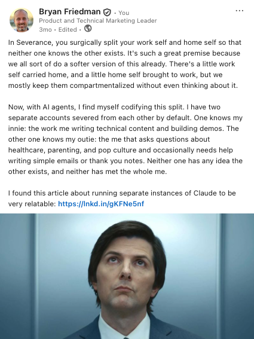

I hadn't used it in a bit, but I randomly opened ChatGPT on my Mac the other day, and for a second, I thought I was in Claude.

The whole UI was different from how I remembered it, and it was styled much more like Claude's interface. They both always had the sidebar and the chat window, but now it seemed like ChatGPT even switched to using a similar font and color palette. I did a double take and realized that it was indeed ChatGPT. 

When I started at Moderne, I was [copy-pasting things in and out of ChatGPT](https://www.bryanfriedman.com/blog/between-two-summits-one-year-in/#the-ai-of-it-all) all day. Then as I used Claude more and more at work, I switched to using it at home too. So I only open ChatGPT once in a while, but while I was gone it apparently redecorated to look like the place I moved to.

## Good Artists Copy

If you're of a certain age, this feels familiar. Remember Mac vs. Windows? I was a little bit too young to follow it while it was going on, but that's okay because it was made into one of my favorite TV movies of all time: *Pirates of Silicon Valley.* The movie dramatizes how Apple built its graphical interface after a famous visit to Xerox PARC. As Noah Wyle's Steve Jobs puts it in the film, "Good artists copy, great artists steal."

But then of course, Microsoft built Windows after Bill Gates visited Apple, and that quote about artists came back to bite Steve Jobs. This leads to probably my favorite scene in the film: when Steve accuses Bill Gates of ripping off the Mac, and Bill Gates said it was more like they both had a rich neighbor named Xerox, and Steve says that Apple has better stuff, and Bill Gates says "You don't get it Steve. That doesn't *matter!*" (I don't know if it quite went down [exactly like this in real life](https://www.folklore.org/A_Rich_Neighbor_Named_Xerox.html), but the Anthony Michael Hall and Noah Wyle version is *my* reality anyway.)

Feels like OpenAI and Anthropic are following a similar pattern, "stealing" from each other back and forth. Claude shipped [Artifacts](https://www.anthropic.com/news/claude-3-5-sonnet), so ChatGPT shipped [Canvas](https://openai.com/index/introducing-canvas/). ChatGPT shipped [Deep Research](https://openai.com/index/introducing-deep-research/), then Claude shipped [Research](https://www.anthropic.com/news/research). [Claude Code](https://www.anthropic.com/news/claude-3-7-sonnet) came out, and then [Codex](https://openai.com/index/introducing-codex/). Concepts within the apps like projects, memory, voice, connectors, computer control...take your pick of features, and you're bound to see the other one either has it or is about to. When OpenAI rolled out its new desktop "superapp" this summer, [PCWorld's headline](https://www.pcworld.com/article/3188176/the-new-chatgpt-superapp-takes-aim-at-claude-desktop.html) put it bluntly: "The new ChatGPT superapp takes aim at Claude Desktop." (ChatGPT even started naming their models using a theme, like Anthropic does, instead of the confusing names they had before.)

And of course there's more than just two players in the market. Microsoft has Copilot, Google has Gemini, and in the software coding space it gets even more crowded with the coding version of each of those plus Cursor, Windsurf, Amp, the list goes on. 

Of course I understand this is how business works. Apple's rivalry didn't stop with Microsoft, as years later it had Samsung in its sights from the iPhone vs Android fight. The cloud providers all do it too, with each of them having equivalent versions of products they've copied over the years. It's not even limited to software or technology, either. Long before any of this, there was Nike vs. Adidas, Ford and Ferrari, and the ever-present question: Coke or Pepsi? So it's nothing new, but it's noteworthy because of the moment we're in. (More on that later.)

But for all the sameness on the surface, like any tech, underneath the hood, no one can agree on much. For instance, there are so many places to put instruction files to tell an agent how to behave in your project: Claude Code reads `CLAUDE.md`, but GitHub Copilot reads `.github/copilot-instructions.md`,  and Google even has `GEMINI.md`. Cursor has its own rules folder too. So of course the problem got solved in the [most xkcd way](https://xkcd.com/927/) possible: the `AGENTS.md` standard.

## So Which One Should You Use? (Yes.)

This is not a comparison piece, so I'm not going to get into details, but the answer to a question like that is usually: "it depends." For me, the landscape looks something like this:

* **Claude.** At this point it's my default. I've found it to be the most reliable for all of the various things I do. I use it almost exclusively at work to write, code, and answer dumb questions. At home, it's helped me build complex spreadsheets, plan house projects, design web sites, and...answer dumb questions.
* **ChatGPT/Codex.** The original. It got me started both at home and at work. Even when I started using Claude at work, I stuck with ChatGPT at home, thinking it would be a good split. I even used Codex for coding projects at home. Now I've migrated to using Claude most of the time, even at home. I've kept ChatGPT around mostly for historical purposes. It was sort of my pseudo-doctor/therapist well before Claude came around, so I still use it for that sometimes, since it "knows me."
* **GitHub Copilot.** This is the other go-to option at work for me, and I like using it for coding work sometimes, if I've maxed out my Claude usage, or if it's annoying me. It can use both OpenAI and Anthropic models, or switch between them, and it will sometimes even decide for you, depending on the task. It's also got great integration with tools I already use. 
* **Gemini.** I experimented with [Antigravity](https://antigravity.google) for a bit, and occasionally reach for Gemini within Google Docs or something. But I really haven't used Gemini much at work. I try to "search" (or ask those dumb questions) with AI, but I still end up Googling some things (old habits die hard), so I'll often end up using the AI Overview feature of Google and finding myself almost unwittingly inside of Gemini.

What are people using? Most everyone I know, at least in the consumer space, is pretty much sticking with the horse they rode in on and using ChatGPT for everything. My family mostly does that, but I've also converted a few friends and family over to the Claude side. (The [government contract stuff](https://medium.com/utopian/deletechatgpt-ab17bd8550da) helped.)

I know some folks swear by one choice for writing (ChatGPT) and another for images (Gemini). Lots of people are probably just using whatever their company pays for, or (like I sometimes do) whatever shows up at the top of Google. Some folks use one at work and a different one at home. I kind of do that too, except with two Claudes.

So how does anyone decide? Remember what Bill Gates said (in the movie): it doesn't really matter.

## The Model Is Only Part of the Story

Most AI conversations focus on the model, but the model is only one layer. The other is the **harness**: the software wrapped around the model that decides what context it sees, which tools it can use, how its work is structured, and when it stops.

That's where a lot of the variability lives. Remember all those instruction files? We write them carefully, spelling out which tool to use for which job. Sometimes the agent follows them perfectly, and sometimes it reads them, nods, and does something else. (Kind of like my kids.) It's tempting to blame the model, but often the harness is the one deciding how much weight those instructions get, or whether they're still in context at all. And when a new version drops (of the model *or* the harness), a workflow that was reliable at one point may all of a sudden behave totally differently.

This is something I'm seeing a lot of at work, as we try to steer agents to use the right tools for the the job, and often find them colliding with other tools, or the instincts of the agent in general. But if anything, that's given me even more appreciation for deterministic tools that do exactly the same thing every time you run them. (Like the ones we build at Moderne, of course!)

## Who's Paying for All These Tokens?

The other thing that's happening right now is that the economics are completely upside down.

Most of us pay for AI like a gym membership: flat monthly fee, all you can eat, within limits. That means the heaviest users get the best deal, but "within limits" also keeps getting redefined. Five-hour windows, weekly caps, pricier plans...it all seems to be a slow slide toward paying per token. GitHub Copilot  already moved to [usage-based billing](https://github.blog/news-insights/company-news/github-copilot-is-moving-to-usage-based-billing) back in June because a quick chat question and a multi-hour autonomous coding session was potentially costing the same amount for the user.

And while it's true that the price of a token will continue to fall, agents are chewing through tokens at a faster and faster clip, so even if the gas is getting cheaper, it's like we're driving a bigger truck.

It reminds me of the cloud provider race-to-zero pricing from the early 2010s. I don't know how this ends and if we'll settle into something more sane, or if it  just keeps getting cheaper and cheaper while we keep using more and more? 

## Paper First

I recently had back-to-school night for my daughter's high school, and one of the teachers told us that all writing for his class happens in the room and on paper. No homework, no laptops.

At first that sounded insane to me. No laptops? It's 2026! And we can't ignore AI. It's here!\
\
But his explanation made sense to me. He's not anti-AI. In fact he thinks there's a place for these tools and that his students will use them. He just doesn't think kids at this age are ready to use them responsibly yet, and more importantly, they need to build the underlying skill first. You can't tell whether AI wrote something good if you've never learned what good looks like. And that applies to the rest of us too.

It's the same conversation engineering teams are having about [junior and senior developers in the age of AI](https://www.weforum.org/stories/artificial-intelligence/as-ai-reshapes-entry-level-software-jobs-where-will-senior-developers-come-from/). A senior engineer can look at what an agent produced and spot the problem fast, because they've made that mistake before. A junior engineer might not see it at all. I notice this in my own work. When an agent's draft of a doc is off, I can usually tell how and guide it a different way or change it myself. When it writes Java, though, I'm a lot less sure, because it's been a long time since I was a real software engineer. (My skill level for coding is good for prototypes, but not so much production-ready code.)

## Haven't We Been Here Before?

I get why this feels existential for a lot of people. Bill Gates (the real one, not Anthony Michael Hall) just published [a long essay](https://www.gatesnotes.com/work/make-ai-work-for-everyone/reader/a-turbulent-ai-era-and-critical-choices-to-make) saying he's "very concerned": about entry-level jobs disappearing (software engineering included), about what AI does to kids' development, and about how few people outside the industry are paying attention. (Turns out, maybe it *does* matter?)

It's not a perfect analogy, but the current moment reminds me a bit of the rise of the internet. Email changed how we worked, and the web changed the concept of what a business even was. But Gates argues that this is different from past technology shifts, because it substitutes for human thinking itself and it's happening over a decade instead of generations. So he'd probably say my go-to comparison undersells it. 

So is this really a *Pirates of Silicon Valley* story, or is it more the AI version of *The Social Reckoning*? As a big Aaron Sorkin fan, I'm excited about that movie coming out, but less excited about the fact that it's based on a true story. It's not so much Mac vs. Windows because the question maybe isn't "who's going to win?" and more "do we all lose?"

I don't know which movie we're in yet, but it's probably too soon to say. Either way, AI is here, so there's no ignoring it. AI apps will continue looking more and more like each other, the features will keep leapfrogging, and which logo you align with will matter less than whether you recognize good output when you see it. Because regardless of which one we use, we have to learn to write on paper first.
