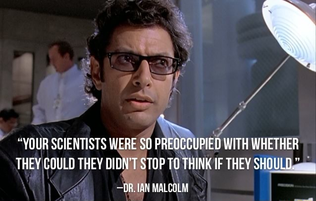
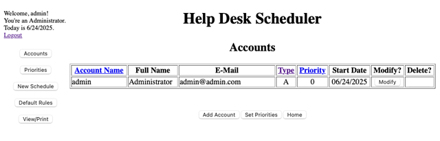

I'm sure you know this classic line from _Jurassic Park_:

> “Your scientists were so preoccupied with whether or not they **could**, they didn’t stop to think if they **should**.” &mdash;Dr. Ian Malcolm, Jurassic Park

That quote was about cloning dinosaurs, but honestly, it also applies pretty well to a scenario I'm now facing: resurrecting long-dead source code.

Recently, [I joined the team at Moderne](/blog/career-refactoring/), where I’ve been diving into the world of automated code remediation and transformation using [OpenRewrite](https://docs.openrewrite.org). It’s powerful tech that can scan large codebases and apply structured, deterministic changes like it actually understands the code (because it basically does).

I've been wanting to write some custom OpenRewrite recipes as a learning exercise, and I've been looking for a good idea to try out. This got me thinking: What kind of code would be fun (and maybe a little terrifying) to experiment on?

That’s when I remembered Help Desk Scheduler, the scheduling system I built for my senior project in college circa 2003. It was powered by Struts 1, backed by MySQL 4, and built with Java 1.2 with no build tool in sight.

What could possibly go wrong?

## Digging Up Fossils

The Help Desk Scheduler (HDS) was a handy tool I created while working at the Cal Poly ITS Help Desk. It was a web app that generated work schedules for staff and students based on user-defined rules. It let supervisors schedule student workers, manage shift swaps, and view schedules in various formats. It solved a real problem, and it actually worked!

Back then, frameworks like Struts 1 were still new and exciting, Tomcat 4 was the default server choice, and MySQL was all the rage. For this project, I built everything with raw `javac` commands in a batch file. No WAR file. No CI/CD. Just a folder full of class files and a dream.

Somehow, I had kept a copy of the source code, preserved like a mosquito in amber, complete with J2EE DNA. So I decided to see: could I bring this fossilized application back to life and use it as a playground for OpenRewrite?

## Reanimating the App

Getting it running again meant digging through ancient APIs, outdated assumptions, and a build process so flaky that I can hear Dennis Nedry now: “Uh uh uh, you didn’t say the magic word!”

Here’s what it took to get it running in 2025:
  
- Sticking with Tomcat 4 (v4.1.24 downloaded from the [Apache archives](https://archive.apache.org))
- Using the oldest "supported" version of MySQL: 8.0.13 (plus a newer JDBC connector)
- Tweaking the database schema and JDBCRealm configuration to support MySQL 8
- Swapping out JavaMail SMTP for MailDev (good enough for these purposes)
- Dockerizing everything with docker-compose to make things easy to run (and portable)

After a weekend of tinkering and a few "I can't believe this is working" moments, I had the app running again in my browser, in all of its ugly, table-based, CSS-less glory.

**You can check out the repo [here](https://github.com/bryanfriedman/help-desk-scheduler).**

## But... Why?

Let’s be clear: I have no plans to offer a commercial or even production-ready app. But having a working legacy app gives me a useful, safe, and fun sandbox for experimenting with modern code transformation using OpenRewrite.

Some experiments I’m thinking about trying on this codebase:

- Migrate from MySQL to PostgreSQL
- Upgrade to Java 21
- Replace Struts with Spring MVC (or Struts 2, or something else)
- Move hardcoded config to external properties
- Swap out the authentication layer
- Eventually maybe even refactor into something that resembles a modern Spring Boot app

Most of these are squarely in OpenRewrite’s wheelhouse, but I can also try for some stretch goals to give me a way to explore how far automation can take things vs. where manual intervention may still play a critical role.

## What’s Next

Now that I’ve got this prehistoric app running again, I plan to document my OpenRewrite experiments in future posts. I’ll explore what works and what breaks, and where automation helps or not when dealing with very old Java code.

But for now, I’m just happy that I got this dinosaur of a project running again. Not because I _should_, as a wise chaotician might say, but because I _could_. I hope the servlets don't bite!