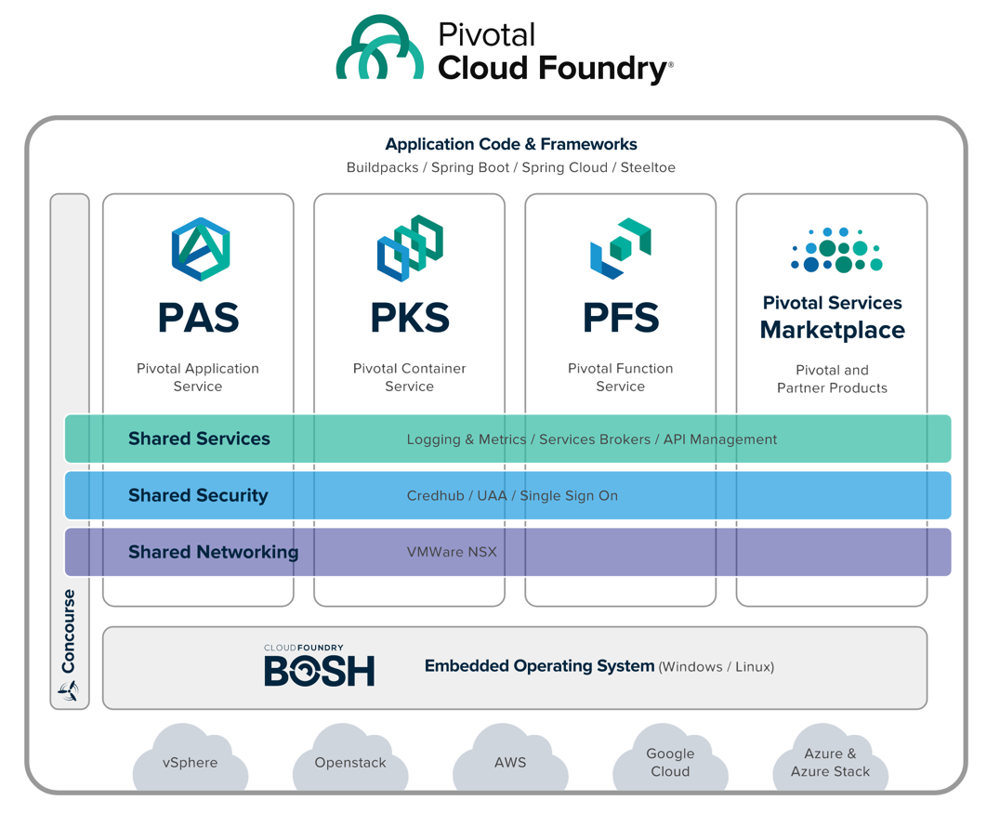
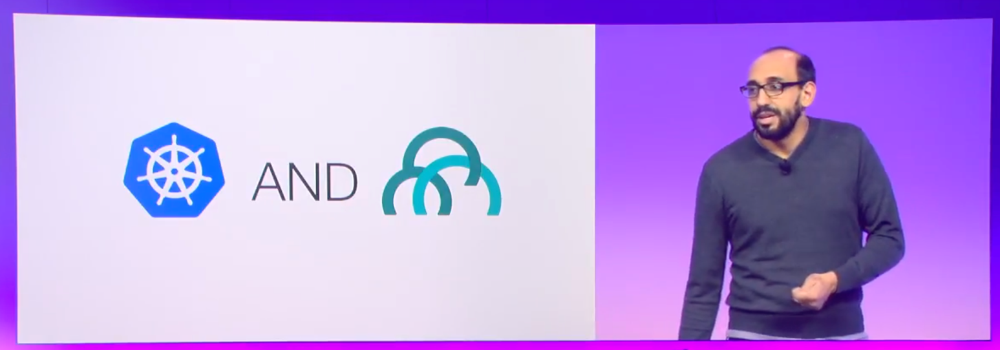

After two full days at my very first [SpringOne Platform](http://springoneplatform.io/), my head is spinning. At times I've felt excited, lucky, proud, impressed, and overwhelmed -- sometimes all at the same time. So what's the best thing to do when I'm feeling all the feelings? Write about it!

I've been having lots of thoughts that I can't shake in two key areas so I want to share about them.

### PCF 2.0: It's a Cloud!

During the keynote on Tuesday, among a slew of announcements, Onsi Fakhouri unveiled PCF 2.0. I'm not going to get into the details here, but you can (and should!) [read all about it](https://content.pivotal.io/announcements/pivotal-unveils-expansion-of-pivotal-cloud-foundry-and-announces-serverless-computing-product) and [watch Onsi's incredible presentation](https://www.youtube.com/watch?time_continue=1&v=_uB5bBsMZIk) if you haven't already.

A few months ago, I caught a glimpse of what was coming with PCF 2.0. When I saw a rough sketch of the "four pillars" on a whiteboard, I thought "Hey! That's a cloud!" It sounds silly to me now. Of course it's a cloud! It's right there in the name. Pivotal _Cloud_ Foundry. And PCF 2.0 is its natural evolution.

To be clear, I'm not interested in having a "what is the cloud?" discussion. (I already get that with my family when they ask me what it is that I do.) Still, it's fair to say that the cloud encompasses many things these days. Public clouds now offer such a breadth of products and services that it's hard for some customers to keep up. At the same time, customers have more and more types of workloads and want more and more choices.

All the public clouds have an app service, a container service, and a functions (serverless) service. Some have more than one of each! They all also offer many data persistence and messaging services. So the concept of Pivotal Cloud Foundry offering these same products makes total sense. PCF is staying just opinionated enough. [Like Richard Seroter commented in his summary of Day 1](https://www.linkedin.com/pulse/springone-platform-day-1-its-learning-richard-seroter/), customers will have choices, but not too many. The reality is that customers are running in on-premise data centers. They need workloads to run in hybrid or multi-cloud environments. IaaS isn't enough to constitute a "private cloud" anymore. But PCF 2.0 sure is. (And it's not even limited to _that_. It runs on public clouds too, remember!)

Everyone at SpringOne Platform seems pretty pumped about the announcements. But I've heard of other folks wondering why Pivotal introduced PKS when they already have PAS. Some may wonder why anyone would still use PAS once they have PKS. And of course, there are many who don't yet understand what role serverless has to play and why PFS is even a thing. It's simple. They are all choices. Did anyone ask Amazon why they didn't kill their app service once they launched a container service? As Onsi said in his talk, the conversation is not an "OR" conversation. It's an "AND" conversation. PCF will be able to handle all customer workloads.

During Wednesday morning's keynote, I felt a little like a kid eating ice cream for the first time. It was riveting watching [Kim Bannerman and Meaghan Kjelland do a PKS demo](https://www.youtube.com/watch?v=yuEFJePhrLQ) and seeing Mark Fisher show off [riff](https://github.com/projectriff/riff). There is such an exciting future for PCF and I'm stoked I get to go along for the ride.









### Did Somebody Say "Digital Transformation"?

SpringOne Platform is full of developers and technology enthusiasts. There are plenty of tech talks and deep dives into code and platform architecture. I love that stuff and I attended a few sessions like that. Mostly though, I opted to attend the more customer-driven sessions. I haven't yet gotten to talk to enough customers in my time here, so I wanted to see the success stories up close.

See, [I worked in IT at a large enterprise for 11 years](http://www.bryanfriedman.com/2014/05/16/11-years-later-2/). I saw how things run in an organization like that. I've been gone for more than 3 years, but I still know people there. Not very much has changed. They can get VMs provisioned a little faster now, but that's about it. So while I work for a company whose mission is to "transform how the world builds software," my experience in enterprise IT is so tainted, it has still been hard to fathom that it's actually possible.

But believe me, it is. Digital transformation is real, and it's spectacular. It's true that "digital transformation" as a term may be over used. It's probably the phrase I heard the most during all the sessions (aside from maybe "we're hiring"). The thing is though, buzzword or not, companies are actually doing it. And Pivotal is making it possible.

I listened to industry giants from many sectors — telco, banking, insurance, government, automotive — all tell amazing stories. It was inspiring. Refreshing even. It was beautiful. I found myself feeling sorry for my younger self, stuck in the past and trapped in a cloud-foreign world. It may sound hyperbolic, but I'm not kidding when I say there were moments of shock and awe. It's like meeting Big Foot. You've heard the rumors, you know the legend, but it's not real until you see it.

Of course, these companies' journeys aren't over. Far from it. They know that. They all said it. But they know the path now. They have the confidence they need to move forward. Or at least to move. Pivotal showed them the way and continues to partner with them on their journey. Like Onsi said, it's all about learning.


















