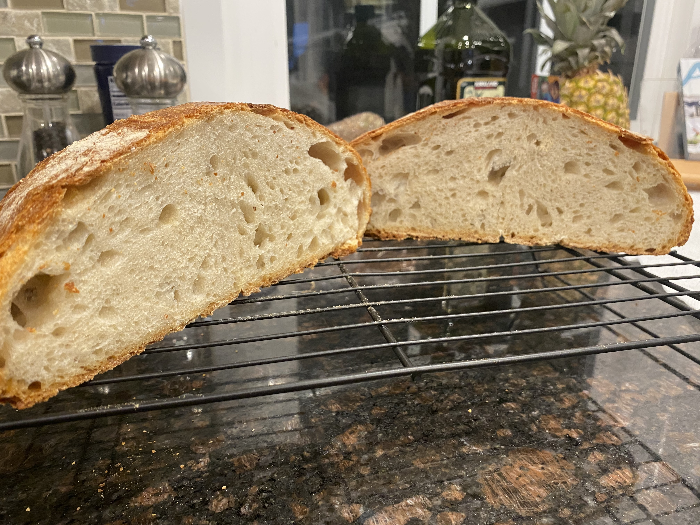

A favorite joke of mine that I remember from the wall of my computer lab in college goes "There are 10 types of people in this world: those who understand binary, and those who don't." (Get it? "10" in binary is 2. Okay, moving on.) Of course, there are many more types of people than that. (It's just a joke.) There are also many more than two types of *types*. Blood type. Type A personality. Type 1 diabetes. "He's not really my type." Dog people or cat people. Coffee or tea. Types upon types, but really they all just come down to the simple question: *what kind of thing is this?*

In software development, we learn early on that "type" means something very specific — a *data type*. Most people have heard of `string` and `integer`, and maybe they know about `float` and `boolean`. But you can also make up your own kind of types: `ShoppingCart`, `BlogPost`, `Dinosaur`. You get the picture. 

For you non-developers out there, you might be surprised to find that in programming circles, the topic of "types" can sometimes come with strong opinions. Just how strict you should be about types is one of those things that can really get people going. Think tabs and spaces, or text editor holy wars. To everyone outside of tech, this sounds like nonsense. When my wife and kids ask me at the dinner table "what do you actually do, Dad?" and I try to explain the importance of types, they stare at me blankly. So this post is really for them, but maybe you'll learn something too.
 
I'll try to explain it by using a trick that a colleague once taught me: the "Five Whys." Like a toddler, you just keep asking "but why?" until you hit the bottom of something. So we'll start simple and go a little deeper at each step. Stay with me now...

## Why do we have types?
 
A type is just a label for what kind of thing a piece of data is: a number, a word, a date. Some programming languages make you label everything, while others let you skip it. To see why that matters, think about the difference between cooking and baking. (See, girls? We're starting with food. You're going to be fine.)
 
When you're sautéing something, you can wing it with a pinch of salt, a glug of oil, a handful of whatever's in the fridge. This is how my wife cooks: fast, furious, and leaves a trail of bowls, utensils, and a countertop mess in her wake.

My wife in the kitchen{.caption}

That's like **JavaScript**, a "loosely typed" language. You can put anything anywhere, and it'll even let you add the number 5 to the word "banana." Instead of stopping you, it happily hands back `"5banana"` like it did you a favor.
 
Baking is a different story, though, because baking is chemistry. The wrong amount or a missing ingredient, and your bread doesn't rise or your cake is a brick, and you won't know until it's done and too late to fix. This is more my style of cooking: measure everything, read the whole recipe first, lay it all out before I start. I'm slower, and it's less exciting, but at least I know what I'm going to get.
 
That's more **Java**, "strictly typed." You declare what kind of thing goes where, up front, and the language holds you to it before it will even compile.
 
The tradeoff is real, and it's the same one my wife and I negotiate over when cooking dinner. Winging it is faster and easier sometimes, right up until the moment precision actually matters. With types, you catch your mistake during prep, but without them, you don't catch it until you open the oven, which, in software, means production.
 
(Because it confuses so many people I talk to, I have to just quickly clarify that Java and JavaScript are *not* the same thing. In fact, they're not even related. JavaScript just borrowed the name to ride Java's popularity back in the '90s, and we've been correcting people about it ever since.)
 
## Why would anyone care?
 
I sort of gave this away already, but the reason this matters is that types _let you catch your mistake_ before anyone else does.

Years ago, as a product manager, the engineering team came to me to declare that they would be migrating our JavaScript codebase to TypeScript (a flavor of JavaScript that is indeed typed). This would take up half of our next several sprints, so I wasn't thrilled about it. It was that situation where you have to spend potentially months of engineering time that would produce exactly zero things you can put on a roadmap slide. (See: technical debt.)

But I did understand why they wanted to migrate. Without types, the only way to know if we'd broken something was to run the code and wait to find out. But with them, the compiler would tell us before ever shipping. And sure enough, it saved us several times down the line, when a problem got caught in code review instead of turning into a customer issue.

It's all those times that someone changes something small and deep in the codebase, the kind of change that quietly ripples out and touches things all over the place. The moment they make the change in a typed system, the code lights up and points you to every single spot that broke.

So that's what those months actually bought us: fewer bugs, and the ability to know things about the code without having to run it first.
 
## Why isn't just knowing the type enough?
 
During the COVID years, I jumped on the sourdough bread bandwagon (like so many). It didn't last long because my patience ran thin, but while I was doing it, I learned that not all flour is created equal. All-purpose flour is not bread flour is not cake flour, etc. With sourdough bread, the bread flour was superior. All-purpose might work, but it never came out as good because when you're baking, knowing *which* flour matters. 

One of my few semi-successful loaves{.caption}

Okay, so I'm stretching this metaphor a bit, but I'm trying to extend it to help explain *type attribution*. This is when you have to work out all of the specific types within your code. Developers have long done a version of this by hand using their code editor, where they can easily click on any object and jump straight to where it came from. They can follow the trail back through each file until they find where something was really born. That "click to follow the path" trick only works because the tool has quietly worked out what everything actually is. That's type attribution.

Remember all those types of types? This is where they can come back to bite you. You might have two different `Customer` types that share the exact same name but have nothing to do with each other. One might be a custom version that an internal team wrote, and the other may have been pulled in from some library. Attribution is the work of pinning down which `Customer` this actually is, where it was defined, and what it connects to. Now multiply that across millions of lines of code, and you've got a genuinely hard problem. (Are you still with me now? Hang in there.)

So why bother? Say you want to find every place in a giant codebase that handles sensitive data. You could just search for a word, the way you'd hit Ctrl+F in a document. But plain text search has no idea what anything means. Search for "log" and you'll get tons of hits (comments, typos, `blogs`, `log in`) but not all of them are what you're looking for. But with real attribution, you can find every place that a specific and exact kind of sensitive data flows into a specific and exact logging tool, and get back just those results. Types turn a codebase from a pile of text into something you can actually ask questions of.
 
## Why aren't they all my types?
 
No cook grows their own wheat or churns their own butter. They buy ingredients that somebody else made and then assemble them. Software works the same way. If you're picturing someone building an application by typing out all of the code, that's not quite what happens. (Especially not anymore with coding agents.) Modern software development is maybe 5–10% custom code that you actually write, and 90–95% code other people wrote and open-sourced (gave away for free). 

{.aligncenter}
One of my favorite xkcd comics: "Dependency" by Randall Munroe, xkcd.com (CC BY-NC 2.5){.caption}

That borrowed code has a name — *dependencies* — and they're the pre-made ingredients of software. Nobody writes their own code for the well-solved stuff anymore, like talking to a database or handling dates or doing encryption. And just like those store-bought ingredients for cooking, they're made up of ingredients of their own. Bread came from flour, which came from a mill, which bought wheat from a farm. A typical project pulls in dozens of libraries directly, and then those quietly pull in hundreds more underneath. (We call those _transitive dependencies_.)

It's a daunting task to track our food's supply chain, and it's the same with interconnected systems. We take our food for granted, and many developers take their dependencies for granted too. Understanding your code now means understanding everyone else's code too.
 
## Why does any of this matter?
 
Types tell you what everything is and dependencies tell you where it came from. When you put them together, you've got a sort of digital master cookbook, with every dish listed out, every ingredient included, and every source traced back to the shelf it came from.

And once you have a cookbook like that, you can do things that are otherwise impossible, like swapping an ingredient across ten thousand recipes at once, or finding every dish that used a batch that just got recalled, instead of opening jars one by one and hoping. Remember, we're talking about every kitchen and meal all at once. (That's called scale.)

So, it took quite a long build up and a lot of stretched analogies to get here, but at last, maybe my family will understand a little bit of what I actually do all day. I work with a tool called OpenRewrite which runs on something called recipes. (There's the payoff for that overused metaphor.) An OpenRewrite recipe is a little set of instructions that reaches into all that code and makes a change: find this, upgrade that, replace those, fix this one bug everywhere it appears. The only reason a recipe can do that safely, across the millions of lines of code in enterprise customer environments, is that it isn't just reading the code as text, it's working from the cookbook. (We call it the Lossless Semantic Tree, or LST). It knows the types, it knows the dependencies, and it knows what every ingredient is and where it came from. You could say, it measures before it bakes. Just like I like to do. So now maybe the next time someone asks my girls what their Dad does all day, they can say I help computers cook.