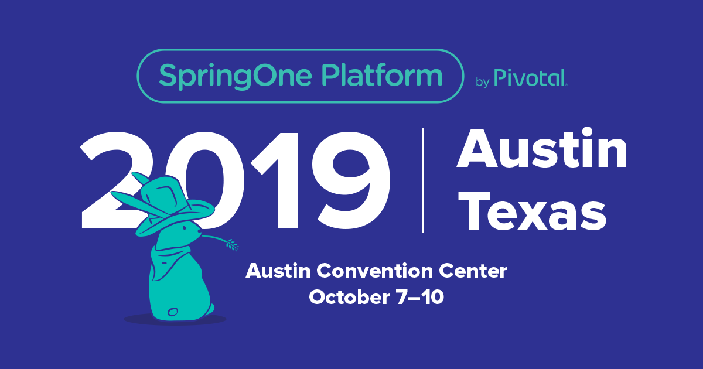

SpringOne Platform is known for showcasing some of the most compelling customer stories you’ll find at any tech conference. [Last year](https://medium.com/@jruckle_27729/a-journey-through-springone-platform-2017-6e67bdfb2c7f), we heard from many leading companies about how they are getting better at software. This year, there were [more](https://www.youtube.com/watch?v=Jip10Fz693U) [amazing](https://www.youtube.com/watch?v=zMLjVRMPHMQ) [tales](https://www.youtube.com/watch?v=wk5lFkIQYL8) of transformation from enterprise leaders. It’s safe to say that “[it’s still about outcomes](https://content.pivotal.io/blog/8-1-2-things-we-learned-at-springone-platform-new-ideas-and-key-affirmations-for-the-modern-enterprise).”

But behind all these great outcomes is a lot of cool tech! I attended quite a few technology-focused sessions this year. They got me excited about the various announcements throughout the week. There was all the stuff you’d expect at a conference called “SpringOne Platform” — [new versions of Spring components, Java 11 talk](https://www.youtube.com/watch?v=onZJ8beVEtI), and [platform releases for PCF and PKS](https://www.youtube.com/watch?v=1ezNJvajUU0). Then there were so many other tech topics that showed up too. I found these five to be the most intriguing:

### 1\. Continuous Everything (CI/CD)

We’ve heard the virtues of [continuous integration](https://springoneplatform.io/2017/sessions/enterprise-ci-cd-scaling-the-build-pipeline-at-home-depot) and [continuous delivery](https://springoneplatform.io/2017/sessions/crossing-the-ci-cd-devops-chasm) at SpringOne before. There’s plenty to be found on the [power of Concourse](https://springoneplatform.io/2017/sessions/concourse-in-the-real-world-a-case-study-in-ci-cd-and-devops) as a CI tool. Even [PCF operators are big on Concourse](https://www.youtube.com/watch?v=dLCbvpQ-HsE) and its ability to provision and repave the platform. This year, there was talk of inviting a new friend to the party.

#### What Happened?

Pivotal announced that it “has a team working on contributing Cloud Foundry support to open source Spinnaker.” Spinnaker already supported AWS, Azure, GCP, Google App Engine, Kubernetes, and other platforms. Now, Pivotal is ensuring that Cloud Foundry is a first-class citizen of Spinnaker. Jon Schneider covered this on the main stage and in detail in a [breakout session](https://springoneplatform.io/2018/sessions/spinnaker-and-the-distributed-monorepo).



#### Why Is It Cool?

Spinnaker is one of the few true multi-cloud delivery platforms. Started by Netflix, it has contributions from Google, Amazon, Microsoft, and now Pivotal. There are two essential components: a multi-cloud application inventory and pipelines.

The inventory piece is critical, since applications rarely live on a single platform. Spinnaker presents an aggregate view of all your applications, clusters, and instances. (It can do this without even having deployed them.) This allows users to determine their application health and state across platforms. It also means Spinnaker is distinctly able to run out-of-band processes. As a result, it supports running things like vulnerability scanning or chaos engineering tooling at build time.

Along with the inventory, as you’d expect from a CD solution, Spinnaker offers pipelines. Even if you are a user of Concourse, Jenkins, or other CI tools, Spinnaker is best suited to help with these delivery aspects of your pipeline.

#### How Can I Get Started?

Check out [Spinnaker on GitHub](https://github.com/spinnaker) and at [https://www.spinnaker.io/](https://www.spinnaker.io/). Keep an eye out for the 1.10 release which will include an early version of Cloud Foundry support.

## 2\. Secure Credentials

Presentations about security topics don’t always offer the most gripping demos. Still, I was very interested in a few of the breakout sessions on CredHub, the credential manager that’s baked right in to Cloud Foundry. It turns out, security can be seductive.

#### What Happened?

CredHub is the credential manager that’s baked in to Cloud Foundry. In his three sessions, Peter Blum offered a few different looks at CredHub. There was a great [overview of how it works with PCF and Spring](https://springoneplatform.io/2018/sessions/credhub-and-secure-credential-management). His most fascinating session, though, brought the magic of [CredHub together with Kubernetes](https://springoneplatform.io/2018/sessions/using-credhub-for-kubernetes-deployments).

In his example, a webhook object in Kubernetes injects CredHub into pods on the cluster. Then application code in the pods may access secrets from the credential store. It was a slick demo and an incredible way to show off CredHub’s simplicity and strong capabilities. Peter’s [CredHub with Kubernetes code is on GitHub](https://github.com/Oskoss/kubernetes-credhub)!



#### Why Is It Cool?

CredHub offers a secure way for humans and applications to interact with secrets. With Pivotal Application Service and the CredHub Service Broker, developers never have to know or see any passwords. Passwords are only available to application containers with authorized access. Each application container includes a signed certificate and key. This key provides identity when communicating with CredHub.

#### How Can I Get Started?

There are tons of amazing CredHub resources out there. Check out some of the recent blog posts from my colleagues:

- [CredHub and The Road to Credential Rotation](https://content.pivotal.io/blog/credhub-and-the-road-to-credential-rotation)
- [Secure Credentials...the CredHub Service Broker...an Inside Look](https://content.pivotal.io/blog/need-to-secure-credentials-for-off-platform-services-in-pcf-try-the-credhub-service-broker-now-in-beta-we-take-an-inside-look)
- [...How the CredHub Service Broker Applies the Principle of Least Privilege...](https://content.pivotal.io/blog/enterprise-architects-its-time-to-learn-how-the-credhub-service-broker-applies-the-principle-of-least-privilege-to-your-secrets)
- [...Protect Your External Service Credentials with Service Instance Sharing...](https://content.pivotal.io/blog/protect-your-external-service-credentials-with-service-instance-sharing-and-the-credhub-service-broker-we-explain-how)

You can also go straight to the [CredHub Docs](https://docs.cloudfoundry.org/credhub/) or the [GitHub repo](https://github.com/cloudfoundry-incubator/credhub) for more detailed info. For you Spring buffs, there’s even a [Spring CredHub project](https://spring.io/projects/spring-credhub).

## 3\. Serverless

What’s a tech conference today without the mention of serverless? SpringOne definitely had its share of serverless moments. Of course, Pivotal Function Service (coming soon) got a [shout-out from Onsi Fakhouri](https://youtu.be/1ezNJvajUU0?t=9m35s). Plus, there were plenty of other details covered about Knative and riff at the conference.

#### What Happened?

[Mark Fisher did a live demo of riff](https://www.youtube.com/watch?v=_OiGt4QwdlM&list=PLAdzTan_eSPQsR_aqYBQxpYTEQZnjhTN6&index=8) on the main stage. There were also some very informative and demystifying sessions on Knative and riff. They ranged from [YAML-heavy](https://springoneplatform.io/2018/sessions/introducing-knative) to [YAML-free](https://springoneplatform.io/2018/sessions/riffing-on-knative) with one especially [for Spring developers](https://springoneplatform.io/2018/sessions/knative-and-riff-for-spring-developers).



#### Why Is It Cool?

At SpringOne Platform last year, [Pivotal announced riff](https://projectriff.io/video/mark-fisher-at-springone-platform-2017/), an open source serverless framework. Earlier this year, Pivotal revealed that [riff was replatformed on top of Knative](https://content.pivotal.io/blog/knative-powerful-building-blocks-for-a-portable-function-platform). This is the technology that is driving Pivotal's serverless future. Knative and riff will power the yet-to-be-released Pivotal Function Service.

#### How Can I Get Started?

Check out [https://projectriff.io](https://projectriff.io) and [https://pivotal.io/knative](https://pivotal.io/knative) for more details. You can also find both [riff](https://github.com/projectriff) and [Knative](https://github.com/knative/) on GitHub.

## 4. Buildpacks Everywhere

Containers and Kubernetes are hot topics at conferences. What's even hotter? Taking control of the application lifecycle in a container-centric world. Developers want a fast and secure way to get from source to container. It’s something the Cloud Foundry community has had solved for a while with buildpacks. Now this solution is expanding.

#### What Happened?

Day 1 main stage had a surprise ending from Stephen Levine from Pivotal and Terence Lee from Heroku. They introduced an effort to bring buildpacks to the broader cloud-native community. It's called Cloud Native Buildpacks, and it joins the CNCF as a sandbox project [_today_](https://www.cncf.io/blog/2018/10/03/cncf-to-host-cloud-native-buildpacks-in-the-sandbox).





#### Why Is It Cool?

Buildpacks are an “opinionated, source-centric way to build applications.” They are a big part of the magic behind Cloud Foundry’s \`cf push\` experience. Buildpacks detect the kind of app then fetch and install the tools needed to run it. For operators, the ability to manage a curated set of buildpacks is attractive. It also allows for rapid, secure patching en-mass using remote image layer rebasing. All the while, developers simply focus on delivering value for their own customers. The new specification and set of tools enable buildpacks to be used on any platform.

#### How Can I Get Started?

Check out [https://buildpacks.io/](https://buildpacks.io/) for more info. Meanwhile, use the [\`pack\` CLI](https://github.com/buildpack/pack) to experiment with Cloud Native Buildpacks.

## 5\. Reactive Programming

Reactive programming is not a new concept for SpringOne Platform attendees. I vividly remember [Phil Webb’s awesome keynote from last year](https://youtu.be/MQamx7-bCVI?t=17m11s) comparing blocking with non-blocking. (Who can forget the swimming ducks and cats?) This year there was more Reactive-related fun.

#### What Happened?

There were two impressive keynotes relevant in the Reactive programming space. First, there was the introduction of the non-blocking relational database connectivity driver, R2DBC. We also learned about RSocket, a new message-based application network protocol.





#### Why Is It Cool?

In two articles on InfoQ, Charles Humble examines both [R2DBC](https://www.infoq.com/news/2018/10/springone-r2dbc) and [RSocket](https://www.infoq.com/news/2018/10/rsocket-facebook). He does an amazing job explaining the advantages of Reactive programming. As Pivotal's Ben Hale explains in one article, "Reactive programming is the next frontier in Java for high efficiency applications." He points out two major roadblocks to Reactive programing: data access, and networking. R2DBC and RSocket aim to address these problems.

I found RSocket to be particularly fascinating. In the main stage presentation, Stephane Maldini gave a brief but helpful history of TCP and HTTP. He framed RSocket as an alternative to these protocols while sort of bringing the best of each to bear. Rather than simply request/response, RSocket offers four different interaction models. (They are Request/Void, Request/Response, Request/Stream, and Stream/Stream.) What's more, it's language-agnostic, bi-directional, multiplexed, message-based, and supports connection resumption. It kind of blew my mind.

#### How Can I Get Started?

As always there’s a .io site for RSocket ([http://rsocket.io/](http://rsocket.io/)) and an [RSocket GitHub repo](https://github.com/rsocket/rsocket). [R2DBC is on GitHub](https://github.com/r2dbc) too. It’s also worth checking out the related content from the conference. Ben Hale covered both [R2DBC](https://springoneplatform.io/2018/sessions/reactive-relational-database-connectivity) and [RSocket](https://springoneplatform.io/2018/sessions/multi-service-reactive-streams-using-spring-reactor-and-rsocket) in his sessions.

### [Next Year in Austin!](https://springoneplatform.io/)

