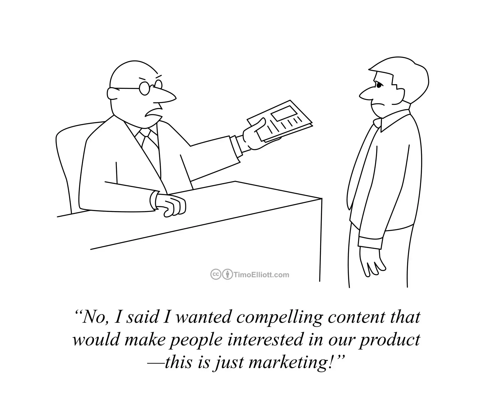

I've found there to be plenty of variance in the industry around job titles, so I usually don't put a ton of weight on them. I've had titles that weren't very descriptive of my actual role. I've had titles that seem to imply something that isn't even true about what I do. I've seen junior-sounding titles for people who seemed pretty senior, and senior-sounding titles for people who acted more junior.

Regardless of the names and levels, I've worked in technology for long enough to have collected several job titles that are difficult to explain at dinner parties or to family members. That's why, when I transitioned from enterprise IT into product management ten years ago, I [wrote a post](/blog/being-a-product-manager) to help answer that dreaded question: “So... what do you do?”

Fast-forward a decade, a few roles, and a handful of technology fads later, and I’ve once again found myself in a job that even people _inside tech_ sometimes struggle to define: **technical marketing**.

Despite being an important function, particularly for developer-facing products, the role of technical marketing can sometimes be confused with engineering, product, or traditional marketing. That's actually fair, though, because tech marketing _does_ borrow elements from all three.

So how is technical marketing different? 

## How Technical Marketing Fits In

Admittedly, the first time I [joined a marketing team](/blog/a-hybrid-career/), I was a bit trepidatious about it, at least initially. Isn't marketing too far removed from the technology itself? Would I ever get to talk to an engineer or even write code again?

I quickly learned that actually, technical marketing isn't so far from product management, or any of the roles I've had in my career really. When I first [got a job as a product manager](/blog/11-years-later), I described it as a role "in the middle", like the connective tissue between customers, engineering, and the business. Technical marketing lives in that same neighborhood, just a few doors down. While product management decides what to build and why, technical marketing focuses more on why what we built matters, and more importantly, _how to show it_. 

I guess that might sort of sound like marketing more generally. Traditional marketing, or more specifically, product marketing, is indeed (at least partially) about telling the story of why something matters — the value proposition, perhaps you've heard it called. But it's that last piece I mentioned before, the "how to show it" part, that I think is the key distinction. A technical marketer can't just _say_ something, they have to _prove_ how it works and build understanding. If marketing inspires people to want to learn more, technical marketing helps them actually get there. 

It's sort of analogous to the sales associate and sales engineer. When a salesperson pitches something in a room full of executives, talking about what it does might be enough. But invite some architects or developers into the room, and you better have a sales engineer there to field the tougher technical questions and show them how it works.

## What About Developer Relations?

Another area I’ve worked in and around is Developer Relations, which I’d describe as at least adjacent to technical marketing. Both disciplines are about building trust with a technical audience, so there’s definitely overlap.

In my experience, Developer Relations is primarily about cultivating a community of practitioners, sparking curiosity, earning credibility, and helping people succeed whether or not they ever become customers. It’s about awareness, trust, and engagement. Technical Marketing, on the other hand, focuses more on _enablement_ and _adoption_, showing how the product delivers value, differentiates, and solves real problems for customers and partners. It's not a perfect delineation (like I said, there's overlap), but I guess you could say DevRel makes fans and Technical Marketing builds believers.

Truthfully, all of these areas — PM, DevRel, and Tech Marketing — sit along the same bridge between technology, communication, and empathy. But each one might put a little more emphasis on a different area: Product Management on strategy, Developer Relations on community, Technical Marketing on proof and enablement. I’ve been fortunate to work in all three, and each helped sharpen different skills from strategic clarity, to technical depth, and creative communication. 

It's why I love these types of roles so much. They let me bring all sides of myself to work: the analytical and the imaginative, the engineer and the storyteller, the tech enthusiast and the theatre kid. It’s where my left brain and right brain finally get equal billing.

## So...What Do You Do?

There are probably several different views on what technical marketing is and how to define it. For me, when I explain my role, I find it’s helpful to break things into two categories (the same ones I used a decade ago when I [wrote about product management](/blog/being-a-product-manager)): what we need to know, and what we actually do.

### What Technical Marketers Need to Know

Unsurprisingly the three key knowledge areas are pretty much the [same as I listed for PMs](/blog/being-a-product-manager/#what-a-product-manager-knows). 

To do this job well, we have to know the **product** as more than just a list of features. We learn it by using it. We dig under the hood to understand how things work, explore the user workflows, and every now and then work through a rough spot to figure out what’s really going on.

We try to stay close to the **market** too. That means understanding not just who competes with us, but what existing customers and potential users are actually struggling with, what’s changing in their world, and where things are headed next. Context matters as much as capability.

The best technical marketers also pay attention to when something isn’t clicking for **customers** (and prospects). Whether it shows up during a demo, in a training session, or in the questions we hear out in the market, those moments usually reveal a gap in how we explain the product. That insight shapes what we build next, from clearer docs to new demos and enablement. Which leads nicely into...

### What Technical Marketers Do

To me, the most fun (and challenging) part of technical marketing is crafting a narrative. I'm not talking about inventing spin, though, because credibility is key with a technical audience. I mean we distill the heart of the value and figure out the most compelling way to reveal it. We make technical concepts feel relevant and even exciting.

In my day-to-day, that might look like:

- presenting a live or recorded demo
- recording feature walkthroughs
- building, facilitating, and maybe even delivering training courses
- writing technical content
- developing competitive materials to help sales and partners position the product
- enabling field teams with deeper technical context
- giving live product demos at tradeshows or events (I was doing this in only my second week on the job!)
- taking questions, confusion, or objections and turning them into clearer messaging or new content

It's a lot of learning in public, which can sometimes mean pushing through impostor syndrome to ultimately show expertise and prove the narrative. 

If you’re curious what this all looks like in practice, here are a few recent examples I had a hand in:

- [Java 25 modernization demo](https://www.youtube.com/watch?v=6LGL64AwEEY)
- [Feature walkthrough video](https://www.youtube.com/watch?v=FQs048JKXVw)
- [Hands-on training](https://docs.moderne.io/hands-on-learning/fundamentals) [sessions](https://www.moderne.ai/moderne-openrewrite-training-hub)
- [Blog about writing OpenRewrite recipes using AI](https://www.moderne.ai/blog/writing-openrewrite-recipes-with-ai)

## Why I Love It

Across every role in my career — IT, product, developer relations, and now technical marketing — the theme has been consistent: translate technology into possibility and turn complexity into confidence.

What’s great is that I get to blend analytical precision with creative expression. The architecture diagrams matter, but so does the storytelling arc. The tech and the theatre kid get to show up every day. That combination is where I feel most at home.
